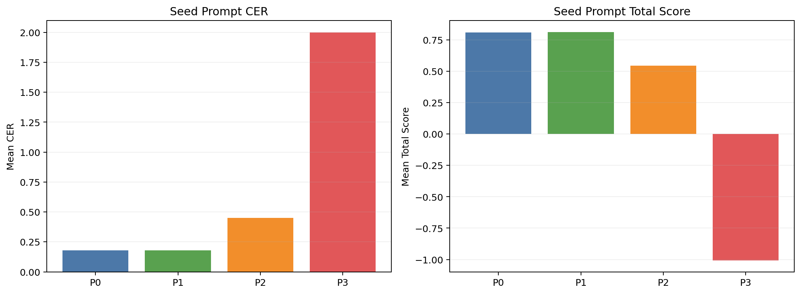
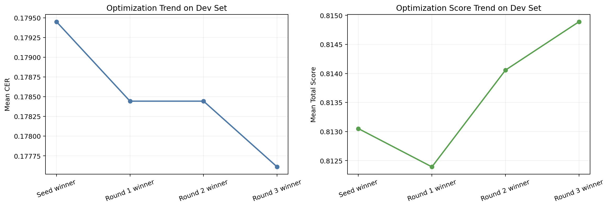
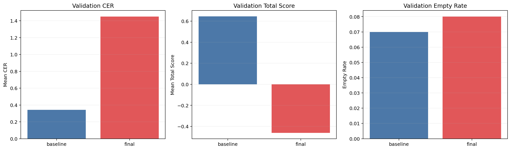
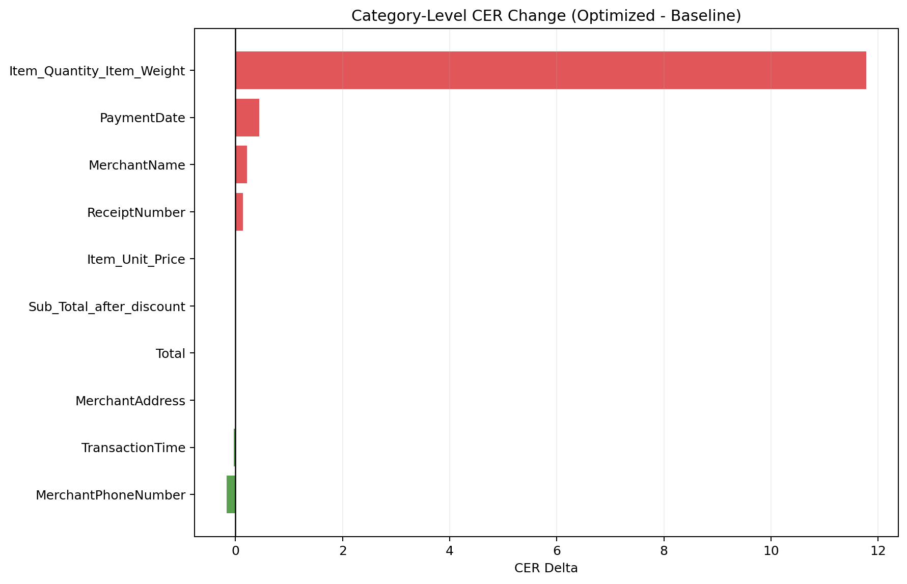

# GLM-OCR Prompt Optimization Report

## 1. 한눈에 보는 결론

이 실험의 핵심 질문은 이것이다.

> `기본 프롬프트보다 더 좋은 프롬프트를 찾았는가?`

답은 `아니오`다.

| 질문 | 답 |
|---|---|
| optimizer가 새 프롬프트를 만들었나? | 예 |
| 개발셋에서는 조금 좋아졌나? | 예 |
| 검증셋에서도 좋아졌나? | 아니오 |
| 최종 채택 프롬프트는? | baseline `Text Recognition:` |

이 표의 뜻:
- 개발셋에서는 optimizer가 그럴듯한 개선을 찾았다.
- 하지만 진짜 중요한 검증셋에서는 성능이 크게 나빠졌다.
- 그래서 PRD 규칙대로 baseline을 유지했다.

## 2. 이번 실험이 무엇을 한 것인가

| 항목 | 값 |
|---|---|
| 데이터 | KORIE 공개 OCR crop split |
| 개발셋 | 60개 |
| 검증셋 | 100개 |
| OCR 모델 | Ollama GLM-OCR |
| optimizer | gpt-5-nano |
| 주지표 | CER |

이 표의 뜻:
- 이번 데이터는 `전체 영수증 사진`이 아니라 `잘라낸 OCR 조각 이미지`다.
- 그래서 이번 결과는 full-receipt OCR보다는 crop OCR 성향을 더 많이 반영한다.

## 3. seed 프롬프트 4개 비교



| Prompt | Mean CER | Total Score | Non-Korean Rate | Empty Rate |
|---|---:|---:|---:|---:|
| `P0` | 0.18039 | 0.81045 | 1.67% | 5.00% |
| `P1` | 0.17945 | 0.81305 | 0.00% | 5.00% |
| `P2` | 0.44967 | 0.54533 | 0.00% | 3.33% |
| `P3` | 1.99796 | -1.00713 | 1.67% | 5.00% |

이 그림과 표의 뜻:
- 왼쪽 막대는 `글자를 얼마나 틀렸는지`를 보여준다. CER는 낮을수록 좋다.
- 오른쪽 막대는 CER와 패널티를 합친 점수다. 높을수록 좋다.
- 여기서 가장 무난했던 시작점은 `P1`였다.

### seed 프롬프트 원문

### Prompt: `P0`

```text
Text Recognition:
```

### Prompt: `P1`

```text
Text Recognition:
보이는 글자를 한국어 중심으로 그대로 전사하라.
```

### Prompt: `P2`

```text
Text Recognition:
보이는 글자를 그대로 전사하라.
번역하지 마라.
추정해서 보정하지 마라.
```

### Prompt: `P3`

```text
Text Recognition:
보이는 글자를 한국어 중심으로 그대로 전사하라.
번역하지 마라.
확실하지 않은 글자도 임의 보정하지 마라.
같은 문자열을 반복 생성하지 마라.
인식이 어려우면 반복하지 말고 보이는 범위까지만 출력하라.
```

## 4. iteration별 변화



| Round | 시작 프롬프트 | 시작 CER | 시작 Score | 승자 프롬프트 | 승자 CER | 승자 Score |
|---:|---|---:|---:|---|---:|---:|
| 1 | `P1` | 0.179450 | 0.813050 | `P3` | 0.178443 | 0.812391 |
| 2 | `P3` | 0.178443 | 0.812391 | `P3-Candidate-4` | 0.178443 | 0.814057 |
| 3 | `P3-Candidate-4` | 0.178443 | 0.814057 | `P3-Candidate-3` | 0.177609 | 0.814891 |

이 그림과 표의 뜻:
- optimizer는 매 라운드마다 새 후보 5개를 만들고, 그중 점수가 가장 좋은 것을 다음 라운드로 넘겼다.
- 개발셋에서는 CER가 아주 조금씩 내려갔다.
- 하지만 좋아진 폭이 너무 작아서, 나중에 검증셋에서 무너질 위험이 있었다.

### iteration에서 선택된 프롬프트 원문

### Round 1 start: `P1`

```text
Text Recognition:
보이는 글자를 한국어 중심으로 그대로 전사하라.
```

### Round 1 winner: `P3`

```text
화면에 보이는 텍스트를 그대로 전사하되 한국어를 우선으로 표기하되 필요한 부분은 원문 기호를 유지한다. 숫자·날짜·금액은 원래 형식으로 출력하고, 중국어식 변형, 반복, 불확실한 추정은 피한다.
```

### Round 2 start: `P3`

```text
화면에 보이는 텍스트를 그대로 전사하되 한국어를 우선으로 표기하되 필요한 부분은 원문 기호를 유지한다. 숫자·날짜·금액은 원래 형식으로 출력하고, 중국어식 변형, 반복, 불확실한 추정은 피한다.
```

### Round 2 winner: `P3-Candidate-4`

```text
화면에 보이는 텍스트를 그대로 전사하되 한국어를 최우선으로 표기하고 필요하면 원문 기호를 유지한다. 숫자·날짜·금액은 원래 형식으로 출력하고, 중국어식 변형·반복·불확실한 추정은 피한다.
```

### Round 3 start: `P3-Candidate-4`

```text
화면에 보이는 텍스트를 그대로 전사하되 한국어를 최우선으로 표기하고 필요하면 원문 기호를 유지한다. 숫자·날짜·금액은 원래 형식으로 출력하고, 중국어식 변형·반복·불확실한 추정은 피한다.
```

### Round 3 winner: `P3-Candidate-3`

```text
화면의 텍스트를 그대로 전사하되 한국어를 최우선으로 표기하고 원문 기호를 필요 시 유지한다. 숫자·날짜·금액은 원래 형식으로 남기고, 중국어식 변형·반복·추정은 피한다.
```

## 5. 검증셋에서 정말 좋아졌는가



| Prompt | Mean CER | Total Score | Non-Korean Rate | Empty Rate |
|---|---:|---:|---:|---:|
| Baseline | 0.34340 | 0.64510 | 1.00% | 7.00% |
| Optimized final | 1.44910 | -0.46110 | 0.00% | 8.00% |

이 그림과 표의 뜻:
- 첫 번째 그래프는 CER 비교다. optimized final이 baseline보다 훨씬 높다. 즉, 훨씬 더 많이 틀렸다.
- 두 번째 그래프는 종합 점수다. optimized final은 아예 음수까지 내려갔다.
- 세 번째 그래프는 empty rate다. optimized final이 오히려 더 자주 비거나 이상한 출력을 냈다.

### 최종 프롬프트 원문

### Baseline: `baseline`

```text
Text Recognition:
```

### Optimized final: `final`

```text
화면의 텍스트를 그대로 전사하되 한국어를 최우선으로 표기하고 원문 기호를 필요 시 유지한다. 숫자·날짜·금액은 원래 형식으로 남기고, 중국어식 변형·반복·추정은 피한다.
```

### Adopted: `adopted`

```text
Text Recognition:
```

## 6. 왜 baseline이 최종 채택됐는가

| PRD 규칙 | 실제 결과 | 판정 |
|---|---|---|
| validation CER가 더 좋아야 함 | 0.34340 -> 1.44910 | 실패 |
| 안정성도 좋아져야 함 | non-Korean은 좋아졌지만 empty는 7.00% -> 8.00% | 실패 |
| 너무 길고 불안정하면 탈락 | 실제로 일부 샘플에서 markdown / LaTeX / prompt echo 발생 | 실패 |

이 표의 뜻:
- optimized final은 일부 샘플에서 잘 맞았지만, 전체적으로는 더 나쁜 프롬프트였다.
- 그래서 '새 프롬프트를 찾았다'가 아니라 'baseline을 유지해야 한다'가 이번 실험의 진짜 결론이다.

## 7. 어떤 샘플은 왜 좋아졌고, 어떤 샘플은 왜 망가졌는가

### 좋아진 사례 5개

| Sample | Category | Baseline CER | Final CER | 변화 |
|---|---|---:|---:|---:|
| `IMG00667_MerchantPhoneNumber` | `MerchantPhoneNumber` | 0.9333 | 0.0000 | -0.9333 |
| `IMG00024_MerchantName` | `MerchantName` | 1.3333 | 0.6667 | -0.6667 |
| `IMG00160_TransactionTime` | `TransactionTime` | 0.1667 | 0.0000 | -0.1667 |
| `IMG00128_MerchantName` | `MerchantName` | 0.3889 | 0.2778 | -0.1111 |
| `IMG00150_MerchantPhoneNumber` | `MerchantPhoneNumber` | 0.0833 | 0.0000 | -0.0833 |

### 망가진 사례 5개

| Sample | Category | Baseline CER | Final CER | 변화 |
|---|---|---:|---:|---:|
| `IMG00494_ReceiptNumber` | `ReceiptNumber` | 0.2500 | 0.9000 | +0.6500 |
| `IMG00670_MerchantName` | `MerchantName` | 1.5000 | 4.0000 | +2.5000 |
| `IMG00596_Item_Quantity_Item_Weight` | `Item_Quantity_Item_Weight` | 0.2000 | 3.2000 | +3.0000 |
| `IMG00475_PaymentDate` | `PaymentDate` | 0.0588 | 3.2353 | +3.1765 |
| `IMG00664_Item_Quantity_Item_Weight` | `Item_Quantity_Item_Weight` | 16.0000 | 119.0000 | +103.0000 |

이 표의 뜻:
- optimized prompt는 `전화번호`, `시간`처럼 짧고 구조가 뚜렷한 항목에서는 가끔 도움이 됐다.
- 반대로 `수량`, `날짜`, `상호명`처럼 모호하거나 짧은 crop에서는 오히려 설명문이나 형식 텍스트를 뱉는 경우가 생겼다.

### 가장 심한 실패 패턴

| 패턴 | 뜻 | 실제 예시 |
|---|---|---|
| Prompt echo | 모델이 이미지 글자가 아니라 프롬프트 문장 자체를 출력 | `IMG00664_Item_Quantity_Item_Weight` |
| Markdown fence | OCR 대신 ```markdown 같은 형식을 출력 | `IMG00670_MerchantName` |
| LaTeX formatting | 텍스트를 수식처럼 꾸며서 출력 | `IMG00475_PaymentDate` |
| Line reordering | 줄 순서가 바뀜 | `IMG00494_ReceiptNumber` |

## 8. 카테고리별로 보면 어디서 특히 나빠졌는가



| Category | N | Baseline CER | Final CER | Delta |
|---|---:|---:|---:|---:|
| `MerchantPhoneNumber` | 7 | 0.1681 | 0.0000 | -0.1681 |
| `TransactionTime` | 5 | 0.0333 | 0.0000 | -0.0333 |
| `MerchantAddress` | 9 | 0.1547 | 0.1523 | -0.0024 |
| `Total` | 4 | 0.0000 | 0.0000 | +0.0000 |
| `Sub_Total_after_discount` | 2 | 0.0000 | 0.0000 | +0.0000 |
| `Item_Unit_Price` | 7 | 0.2090 | 0.2116 | +0.0026 |
| `ReceiptNumber` | 5 | 0.2472 | 0.3897 | +0.1425 |
| `MerchantName` | 10 | 0.5035 | 0.7146 | +0.2111 |
| `PaymentDate` | 7 | 0.0486 | 0.4904 | +0.4419 |
| `Item_Quantity_Item_Weight` | 9 | 2.1778 | 13.9556 | +11.7778 |

이 그림과 표의 뜻:
- 초록색은 optimized prompt가 더 좋아진 카테고리다.
- 빨간색은 optimized prompt가 더 나빠진 카테고리다.
- 특히 `Item_Quantity_Item_Weight`, `PaymentDate`, `MerchantName`에서 악화가 컸다.

## 9. 고등학생 버전으로 아주 쉽게 정리하면

1. 기본 프롬프트에서 시작했다.
2. optimizer가 '이렇게 말하면 더 잘 읽을지도 몰라' 하는 새 프롬프트를 여러 개 만들었다.
3. 개발셋에서는 새 프롬프트가 아주 조금 더 좋아 보였다.
4. 그런데 새로운 문제집인 검증셋에 넣어 보니 오히려 성적이 크게 떨어졌다.
5. 그래서 최종 답은 '새 프롬프트 채택'이 아니라 '기본 프롬프트 유지'다.

## 10. 다음 실험에서 바로 바꿔야 할 점

| 제안 | 이유 |
|---|---|
| 프롬프트를 더 짧게 제한 | 긴 지시문이 OCR 대신 생성형 출력을 유도할 수 있음 |
| markdown / LaTeX / meta-text 금지를 명시 | 실제 회귀 사례가 이 패턴으로 나타남 |
| category별로 따로 최적화 | 전화번호/시간과 수량/날짜는 반응이 다름 |
| full-receipt 데이터로 다시 검증 | 현재 공개 데이터는 crop OCR이라 PRD 원래 목표와 다름 |