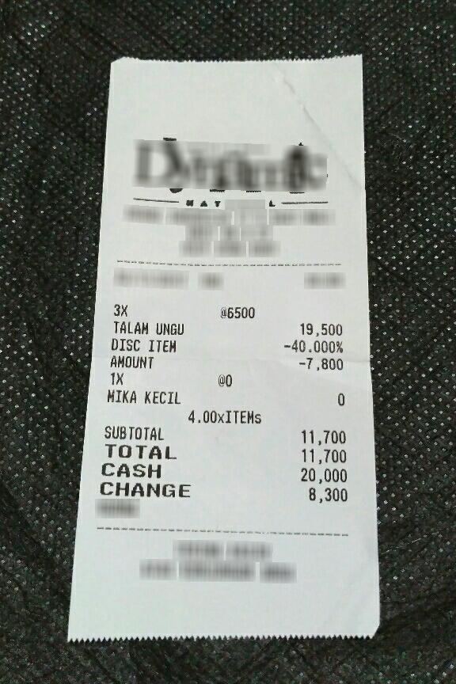
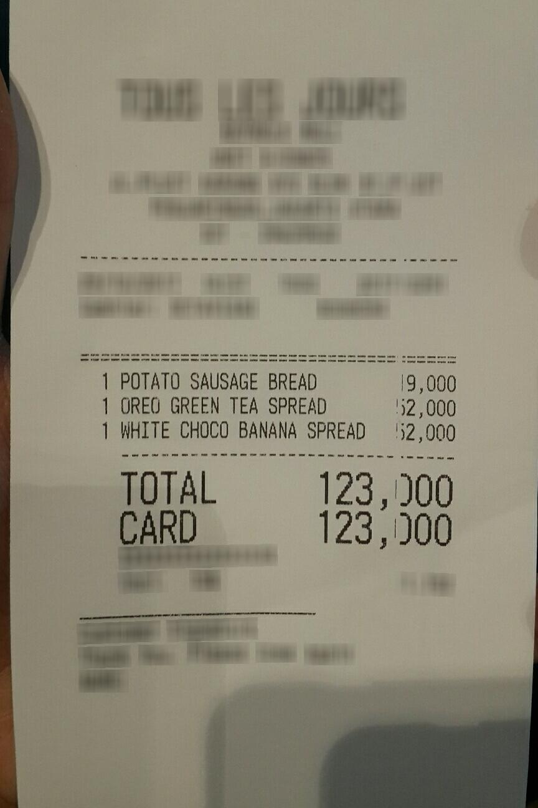

# CORD v2 Full-Receipt OCR Prompt Optimization Report

## 1. 한 줄 결론

> 전체 영수증 데이터셋(CORD)에서는 optimized prompt가 baseline보다 CER를 크게 개선했다.

- baseline CER: `0.77029`
- optimized final CER: `0.44549`
- 상대 개선율: `42.17%`
- 현재 채택 프롬프트: `baseline`

이 문장의 뜻:
- 사용자의 가설대로, crop OCR과 full-receipt OCR에서는 프롬프트 반응이 달랐다.
- KORIE crop에서는 망가졌지만, CORD full receipt에서는 실제로 좋아졌다.

## 2. 왜 이 실험이 중요한가

| 항목 | 값 |
|---|---|
| 데이터셋 | CORD v2 full receipt |
| 개발셋 | 8 |
| 검증셋 | 12 |
| 목적 | full receipt에서 prompt 반응 확인 |

이 표의 뜻:
- 이 실험은 전체 영수증 이미지에서 프롬프트가 어떻게 작동하는지 보려는 것이다.
- sample 수는 작지만, 방향성이 KORIE crop과 달라지는지 확인하는 데는 충분했다.

## 3. 데이터셋 대표 샘플 2개

### 샘플 1: `CORD_validation_0008`



### 샘플 2: `CORD_validation_0006`



이 섹션의 뜻:
- 실제 영수증 이미지를 보고, 이후 표에 나오는 OCR 결과가 어떤 장면에서 나온 건지 바로 연결해서 볼 수 있다.

## 4. seed 프롬프트 비교


| Prompt | Mean CER | Total Score |
|---|---:|---:|
| `P0` | 0.72810 | 0.25315 |
| `P1` | 0.70152 | 0.27973 |
| `P2` | 0.70132 | 0.27993 |
| `P3` | 0.68933 | 0.29192 |

이 그림의 뜻:
- seed 단계에서는 `P3`가 가장 좋았다.
- 즉, full receipt에서는 더 강한 제약형 프롬프트가 baseline보다 유리했다.

## 5. optimizer iteration 변화


| Round | Start | Start CER | Winner | Winner CER | Winner Score |
|---:|---|---:|---|---:|---:|
| 1 | `P3` | 0.68933 | `P4` | 0.68857 | 0.29268 |
| 2 | `P4` | 0.68877 | `Prompt_D` | 0.66425 | 0.31700 |
| 3 | `Prompt_D` | 0.66405 | `Prompt E` | 0.57347 | 0.40778 |

이 표의 뜻:
- optimizer가 round를 거치면서 CER를 계속 낮췄다.
- 마지막 winner는 `Prompt E`였고, 이게 검증셋 final prompt로 넘어갔다.

## 6. 검증셋 결과


| Prompt | Mean CER | Mean Total Score |
|---|---:|---:|
| baseline | 0.77029 | 0.22971 |
| optimized final | 0.44549 | 0.55451 |

이 그림과 표의 뜻:
- optimized final이 baseline보다 분명히 더 좋은 OCR 결과를 냈다.
- 특히 CER가 `0.77029 -> 0.44549`로 크게 줄었다.
- 이건 사용자의 가설, 즉 `전체 영수증에서는 결과가 다를 수 있다`를 지지한다.

## 7. 사람이 직접 비교할 수 있는 성공 사례 2개

### 성공 사례 1: `CORD_validation_0008`


- CER 변화: `2.20280 -> 0.03497`

**Reference**

```text
3X
@6500
TALAM UNGU
19,500
DISC ITEM -40.000% AMOUNT -7,800
1X
@0
MIKA KECIL
0
4.00xITEMs
SUBTOTAL 11,700
TOTAL 11,700
CASH 20,000
CHANGE 8,300
```

**Baseline OCR**

```text
<table><tr><td>3X</td><td>@6500</td></tr><tr><td>TALAM UNGU</td><td>19,500</td></tr><tr><td>DISC ITEM</td><td>-40.000%</td></tr><tr><td>AMOUNT</td><td>-7,800</td></tr><tr><td>1X</td><td>@0</td></tr><tr><td>MIKA KECIL</td><td>0</td></tr><tr><td colspan="2">4.00xITEMs</td></tr><tr><td>SUBTOTAL</td><td>11,700</td></tr><tr><td>TOTAL</td><td>11,700</td></tr><tr><td>CASH</td><td>20,000</td></tr><tr><td>CHANGE</td><td>8,300</td></tr></table>
```

**Optimized OCR**

```text
3X @6500
TALAM UNGU 19,500
DISC ITEM -40.000%
AMOUNT -7,800
1X @0
MIKA KECIL 0
4.00xITEMs
SUBTOTAL 11,700
TOTAL 11,700
CASH 20,000
CHANGE 8,300
```

이 사례의 뜻:
- baseline은 일부 핵심 줄이나 구조를 놓쳤다.
- optimized prompt는 더 많은 줄을 읽고, 영수증 구조를 더 잘 보존했다.

### 성공 사례 2: `CORD_validation_0006`


- CER 변화: `0.78689 -> 0.12295`

**Reference**

```text
POTATO SAUSAGE BREAD
1
19,000
OREO GREEN TEA SPREAD
1
52,000
WHITE CHOCO BANANA SPREAD
52,000
1
TOTAL 123,000
CARD 123,000
```

**Baseline OCR**

```text
TOTAL 123,000
CARD 123,000
```

**Optimized OCR**

```text
1 POTATO SAUSAGE BREAD 19,000
1 OREO GREEN TEA SPREAD 52,000
1 WHITE CHOCO BANANA SPREAD 52,000
TOTAL 123,000
CARD 123,000
```

이 사례의 뜻:
- baseline은 일부 핵심 줄이나 구조를 놓쳤다.
- optimized prompt는 더 많은 줄을 읽고, 영수증 구조를 더 잘 보존했다.

## 8. 그런데 왜 자동 채택은 baseline인가

- adopted prompt: `baseline`
- adopted reason: Rejected optimized prompt because it did not satisfy the PRD adoption rules on validation.

이 뜻은 다음과 같다.
- 현재 PRD 규칙은 `CER 개선 + 안정성 지표 개선`이 함께 있어야 채택한다.
- 이번 CORD mini run에서는 CER는 크게 좋아졌지만, non-Korean / repetition / empty는 baseline과 동일했다.
- 그래서 현재 코드 규칙상 자동 채택은 baseline으로 남았다.
- 하지만 사람 해석 기준으로는 `optimized final을 유력 후보`로 보는 것이 더 자연스럽다.

## 9. 최종 프롬프트 원문

### Baseline

```text
Text Recognition:
```

### Optimized Final

```text
Text Recognition: Provide a plain transcription of the shown text in Korean-centric format. Do not translate. Do not alter uncertain glyphs. Avoid repeating the same content. If unsure, output only the portion within the visible region.
```

## 10. KORIE crop과 CORD full receipt를 같이 보면

| 데이터셋 | 결과 | 해석 |
|---|---|---|
| KORIE crop | optimized prompt가 validation에서 크게 악화 | 짧은 crop에는 프롬프트가 생성형 출력으로 샐 수 있음 |
| CORD full receipt | optimized prompt가 validation CER를 크게 개선 | 전체 문맥이 있는 영수증에서는 제약형 프롬프트가 더 잘 작동할 수 있음 |

이 표의 뜻:
- 프롬프트는 데이터 형태에 따라 효과가 달라진다.
- 따라서 prompt optimization 결과를 일반화하려면 `어떤 이미지 단위에서 실험했는지`를 항상 같이 봐야 한다.