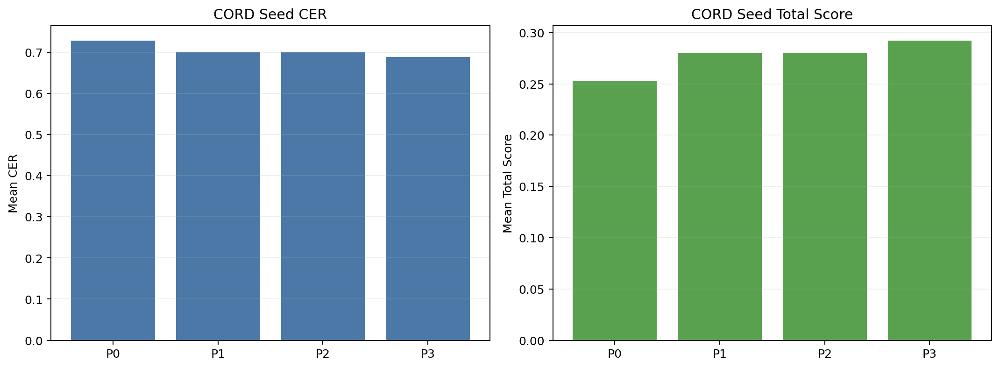
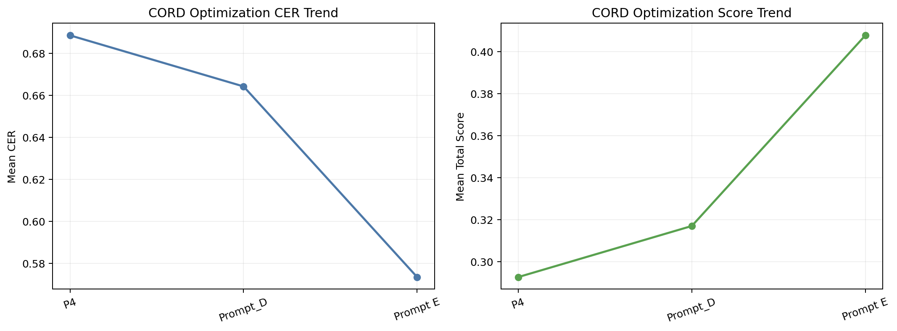
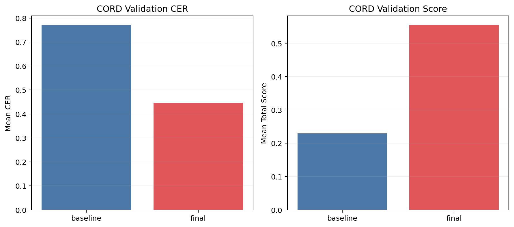

# CORD v2 Full-Receipt OCR Prompt Optimization Report

## 1. 한 줄 결론

> 전체 영수증 데이터셋(CORD)에서는 optimized prompt가 baseline보다 CER를 크게 개선했다.

- baseline CER: `0.77029`
- optimized final CER: `0.44549`
- 상대 개선율: `42.17%`
- 현재 채택 프롬프트: `baseline`

이 문장의 뜻:
- 사용자의 가설대로, crop OCR과 full-receipt OCR에서는 프롬프트 반응이 달랐다.
- KORIE crop에서는 망가졌지만, CORD full receipt에서는 실제로 좋아졌다.

## 2. 왜 이 실험이 중요한가

| 항목 | 값 |
|---|---|
| 데이터셋 | CORD v2 full receipt |
| 개발셋 | 8 |
| 검증셋 | 12 |
| 목적 | full receipt에서 prompt 반응 확인 |

이 표의 뜻:
- 이 실험은 전체 영수증 이미지에서 프롬프트가 어떻게 작동하는지 보려는 것이다.
- sample 수는 작지만, 방향성이 KORIE crop과 달라지는지 확인하는 데는 충분했다.

## 3. seed 프롬프트 비교



| Prompt | Mean CER | Total Score |
|---|---:|---:|
| `P0` | 0.72810 | 0.25315 |
| `P1` | 0.70152 | 0.27973 |
| `P2` | 0.70132 | 0.27993 |
| `P3` | 0.68933 | 0.29192 |

이 그림의 뜻:
- seed 단계에서는 `P3`가 가장 좋았다.
- 즉, full receipt에서는 더 강한 제약형 프롬프트가 baseline보다 유리했다.

## 4. optimizer iteration 변화



| Round | Start | Start CER | Winner | Winner CER | Winner Score |
|---:|---|---:|---|---:|---:|
| 1 | `P3` | 0.68933 | `P4` | 0.68857 | 0.29268 |
| 2 | `P4` | 0.68877 | `Prompt_D` | 0.66425 | 0.31700 |
| 3 | `Prompt_D` | 0.66405 | `Prompt E` | 0.57347 | 0.40778 |

이 표의 뜻:
- optimizer가 round를 거치면서 CER를 계속 낮췄다.
- 마지막 winner는 `Prompt E`였고, 이게 검증셋 final prompt로 넘어갔다.

## 5. 검증셋 결과



| Prompt | Mean CER | Mean Total Score |
|---|---:|---:|
| baseline | 0.77029 | 0.22971 |
| optimized final | 0.44549 | 0.55451 |

이 그림과 표의 뜻:
- optimized final이 baseline보다 분명히 더 좋은 OCR 결과를 냈다.
- 특히 CER가 `0.77029 -> 0.44549`로 크게 줄었다.
- 이건 사용자의 가설, 즉 `전체 영수증에서는 결과가 다를 수 있다`를 지지한다.

## 6. 그런데 왜 자동 채택은 baseline인가

- adopted prompt: `baseline`
- adopted reason: Rejected optimized prompt because it did not satisfy the PRD adoption rules on validation.

이 뜻은 다음과 같다.
- 현재 PRD 규칙은 `CER 개선 + 안정성 지표 개선`이 함께 있어야 채택한다.
- 이번 CORD mini run에서는 CER는 크게 좋아졌지만, non-Korean / repetition / empty는 baseline과 동일했다.
- 그래서 현재 코드 규칙상 자동 채택은 baseline으로 남았다.
- 하지만 사람 해석 기준으로는 `optimized final을 유력 후보`로 보는 것이 더 자연스럽다.

## 7. 최종 프롬프트 원문

### Baseline

```text
Text Recognition:
```

### Optimized Final

```text
Text Recognition: Provide a plain transcription of the shown text in Korean-centric format. Do not translate. Do not alter uncertain glyphs. Avoid repeating the same content. If unsure, output only the portion within the visible region.
```

## 8. KORIE crop과 CORD full receipt를 같이 보면

| 데이터셋 | 결과 | 해석 |
|---|---|---|
| KORIE crop | optimized prompt가 validation에서 크게 악화 | 짧은 crop에는 프롬프트가 생성형 출력으로 샐 수 있음 |
| CORD full receipt | optimized prompt가 validation CER를 크게 개선 | 전체 문맥이 있는 영수증에서는 제약형 프롬프트가 더 잘 작동할 수 있음 |

이 표의 뜻:
- 프롬프트는 데이터 형태에 따라 효과가 달라진다.
- 따라서 prompt optimization 결과를 일반화하려면 `어떤 이미지 단위에서 실험했는지`를 항상 같이 봐야 한다.