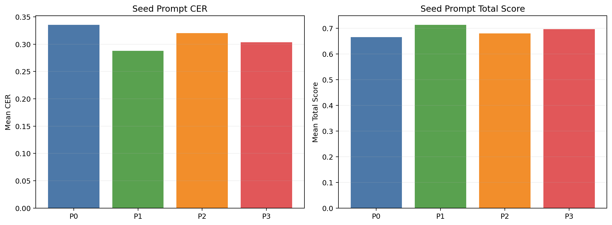
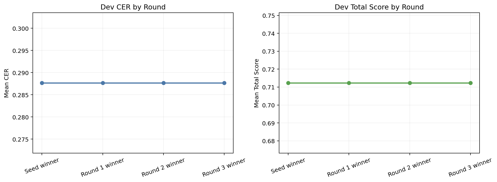
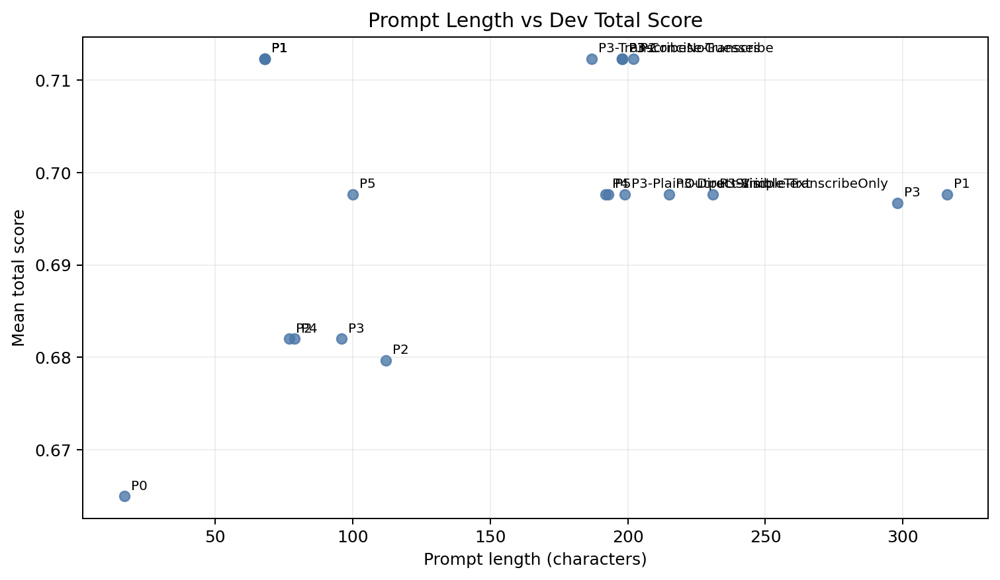
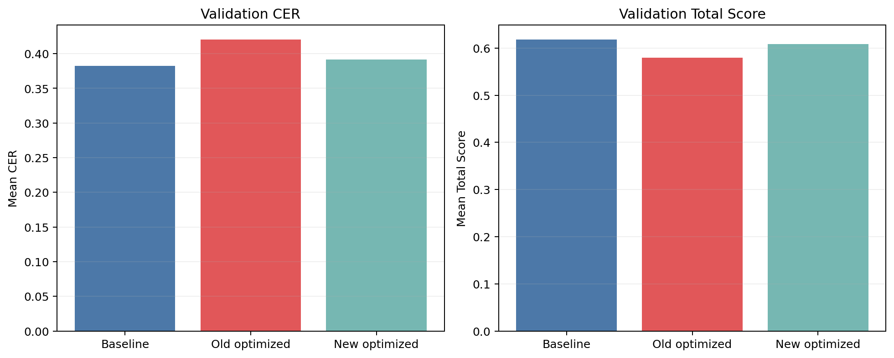
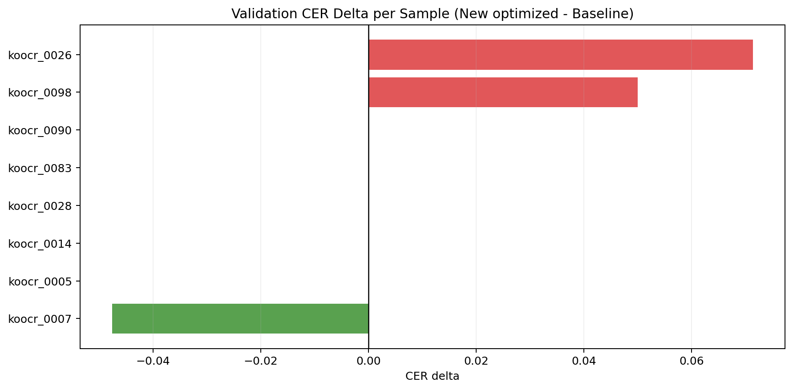

# English-First Prompt Optimizer Report

작성일: 2026-03-14

## 1. 세 줄 요약

| 질문 | 답 |
| --- | --- |
| 영어 우선 optimizer가 이전 optimizer보다 나아졌나? | 예. 같은 검증셋에서 optimized CER가 `0.4201 -> 0.3916`으로 개선됐다. |
| 그래도 baseline을 이겼나? | 아니오. baseline CER `0.3824`보다 아직 조금 나빴다. |
| 최종 채택 프롬프트는? | baseline `Text Recognition:` |

이 표의 뜻:
- 이번 개선은 완전 실패는 아니었다.
- 이전 한국어 중심 optimizer보다 새 영어 우선 optimizer가 더 나았다.
- 하지만 아직 baseline을 넘지는 못해서 실제 채택은 안 됐다.

## 2. 이번 실험이 무엇을 바꿨는가

| 항목 | 내용 |
| --- | --- |
| 데이터셋 | `AbdullahRian/Korean.OCR.Img.text.pair` fast subset |
| dev / val | `8 / 8` |
| 변경점 | seed prompt를 영어 중심으로 바꾸고, optimizer에 영어 우선 규칙과 실패 요약을 추가 |
| 비교 대상 | 기존 한국어 중심 optimized prompt vs 새 영어 우선 optimized prompt |

이 표의 뜻:
- 이번 실험은 모델을 바꾼 것이 아니라 optimizer의 프롬프트 작성 전략을 바꾼 것이다.
- 그래서 해석은 `더 좋은 OCR 지시문을 만들 수 있었는가`에 집중하면 된다.

## 3. Seed Prompt 비교



| Prompt | Mean CER | Mean Total Score |
| --- | ---: | ---: |
| `P0` | 0.3351 | 0.6649 |
| `P1` | 0.2877 | 0.7123 |
| `P2` | 0.3203 | 0.6797 |
| `P3` | 0.3033 | 0.6967 |

이 차트와 표의 뜻:
- `P1`이 가장 좋은 seed였다.
- 즉, 시작점으로는 길고 복잡한 프롬프트보다 짧은 영어 exact-transcription 프롬프트가 가장 안정적이었다.

### Seed prompt 원문

#### `P0`

```text
Text Recognition:
```

#### `P1`

```text
Text Recognition:
Transcribe all visible text exactly as it appears.
```

#### `P2`

```text
Text Recognition:
Transcribe only the visible text.
Output plain text only.
Do not translate, correct, or guess.
```

#### `P3`

```text
Text Recognition:
Read the image and transcribe only the visible text in plain text.
Preserve the observed reading order and line breaks when clear.
Do not translate, explain, normalize, or guess missing characters.
If part of the text is unclear, keep only the visible portion.
Do not repeat text.
```

## 4. Optimization 라운드 흐름



| Round | Start | Winner | Winner CER | Winner Score |
| --- | --- | --- | ---: | ---: |
| 1 | `P1` | `P1` | 0.2877 | 0.7123 |
| 2 | `P1` | `P3` | 0.2877 | 0.7123 |
| 3 | `P3` | `P3-TranscribeNoGuesses` | 0.2877 | 0.7123 |

이 차트의 뜻:
- dev set에서는 첫 seed winner `P1`이 사실상 끝까지 가장 강했다.
- optimizer가 여러 변형을 만들었지만, 대부분 `비슷한 점수의 영어 규칙 프롬프트`로 수렴했다.



이 차트의 뜻:
- 이번 subset에서는 프롬프트를 길게 쓴다고 점수가 좋아지지 않았다.
- 짧고 직접적인 영어 프롬프트가 상위권에 남았다.

## 5. Validation 비교



| Prompt | Mean CER | Mean Total Score |
| --- | ---: | ---: |
| `baseline` | 0.3824 | 0.6176 |
| `old optimized` | 0.4201 | 0.5799 |
| `new optimized` | 0.3916 | 0.6084 |

이 차트와 표의 뜻:
- 새 optimizer는 이전 optimized prompt보다 분명히 나아졌다.
- 하지만 baseline보다 CER가 `0.0092` 높아서, 최종 채택 기준은 넘지 못했다.

### 최종 프롬프트 비교

#### Previous optimized prompt

```text
Text Recognition: 보이는 글자를 가능한 한 원문에 가깝게 전사하되, 문자 대체 금지, 필요 시에만 한글 표기를 사용한다. 중국어 대체, 반복, 추측은 피한다.
```

#### New optimized prompt

```text
Text Recognition:
Transcribe all visible text exactly as shown.
Output: plain text only. Do not translate, correct, or guess.
Maintain reading order and line breaks; avoid duplicate text.
```

#### Adopted prompt

```text
Text Recognition:
```

## 6. 샘플별 영향



| Sample | Baseline CER | New optimized CER | Delta |
| --- | ---: | ---: | ---: |
| `koocr_0007` | 0.7619 | 0.7143 | -0.0476 |
| `koocr_0005` | 0.5000 | 0.5000 | +0.0000 |
| `koocr_0014` | 0.1818 | 0.1818 | +0.0000 |
| `koocr_0028` | 0.1818 | 0.1818 | +0.0000 |
| `koocr_0083` | 0.2143 | 0.2143 | +0.0000 |
| `koocr_0090` | 0.1765 | 0.1765 | +0.0000 |
| `koocr_0098` | 0.4000 | 0.4500 | +0.0500 |
| `koocr_0026` | 0.6429 | 0.7143 | +0.0714 |

이 차트의 뜻:
- 8개 중 1개 샘플에서는 optimized가 더 좋아졌다.
- 5개는 사실상 동일했고, 2개는 더 나빠졌다.
- 즉, 새 optimizer는 `대부분 영향이 거의 없고 일부 샘플에서만 움직이는` 상태다.

## 7. 데이터셋 대표 샘플 2개

### 대표 샘플 1: `koocr_0007`


```text
그닲이에 덜컥 미국 시민이 돼 버렸어옭
```

이 샘플의 뜻:
- 이 데이터셋은 영수증 전체가 아니라, 한국어 line OCR에 가깝다.
- 글자 모양이 난해하고 정답도 표준 문장이라기보다 원문 전사에 가깝다.

### 대표 샘플 2: `koocr_0005`


```text
- 캄이 뭐야옭
```

이 샘플의 뜻:
- 이 데이터셋은 영수증 전체가 아니라, 한국어 line OCR에 가깝다.
- 글자 모양이 난해하고 정답도 표준 문장이라기보다 원문 전사에 가깝다.

## 8. 실제 비교 사례

### Optimized가 더 나은 사례: `koocr_0007`


**Reference**

```text
그닲이에 덜컥 미국 시민이 돼 버렸어옭
```

**Baseline OCR**

```text
그 당일이어 더럽게 미귀 시민이 들어갈 것이여 용
```

**New optimized OCR**

```text
그 당일이여 더럽죽이 구시민이 도대버려격어욕
```

이 사례의 뜻: baseline 대비 CER 변화는 `-0.0476`다.

### Optimized가 더 나쁜 사례: `koocr_0026`


**Reference**

```text
- 걘 다정하기홐도 했어!
```

**Baseline OCR**

```text
- 가끔 다 잘 하기 흘도 해여!
```

**New optimized OCR**

```text
- 가끔 다 잘 하기를 도해야!
```

이 사례의 뜻: baseline 대비 CER 변화는 `+0.0714`다.

## 9. 해석

이번 실험에서 확인된 것은 세 가지다.

1. 영어 우선 optimizer는 이전 한국어 중심 optimizer보다 낫다.
2. 하지만 이 fast subset에서는 baseline `Text Recognition:`이 여전히 가장 강하다.
3. 긴 설명을 늘리기보다 짧고 직접적인 전사 규칙이 더 유망하다.

다음으로 시도할 만한 방향은 이것이다.

1. optimizer가 새 후보를 만들 때 `기존 baseline과 얼마나 다른지`를 더 강하게 제한한다.
2. 실패 예시를 더 적게 주고, 대신 `정확히 어떤 글자 치환이 문제였는지`를 더 구조화해서 준다.
3. line OCR과 receipt OCR을 섞지 말고, 데이터 유형별 optimizer 전략을 분리한다.
