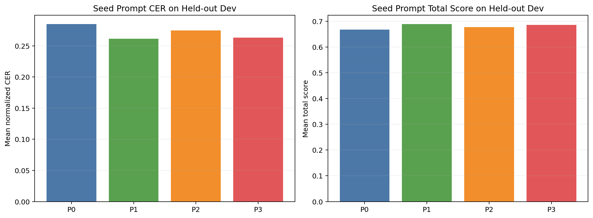
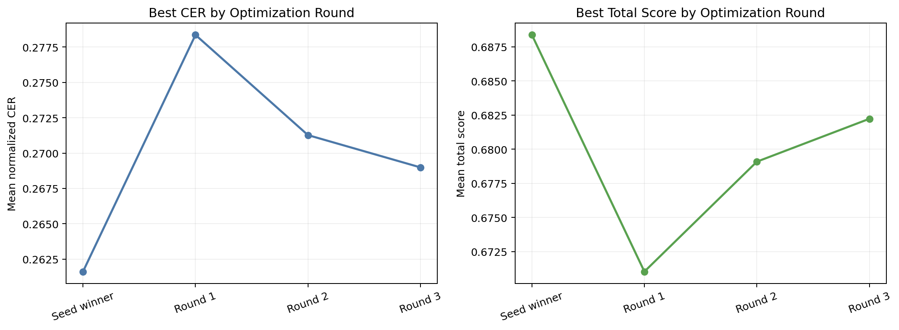
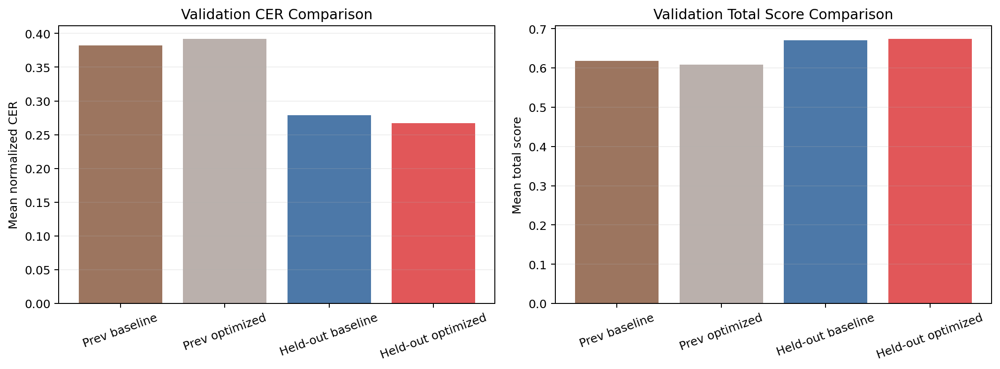
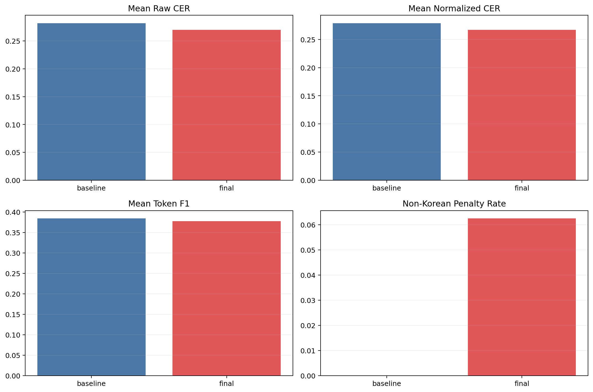
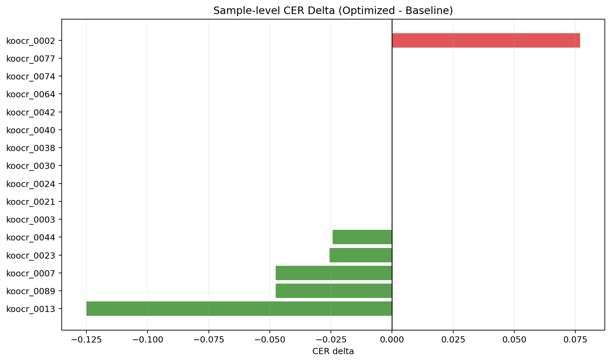

# Held-out Benchmark And Evaluation Upgrade Report

작성일: 2026-03-15

## 1. 세 줄 요약

| 질문 | 답 |
| --- | --- |
| 기존 fast subset보다 이번 실험이 더 믿을 만한가? | 예. `train` 기반 소형 subset 대신, 100개 전체에서 필터링 후 held-out split를 다시 만들었다. |
| optimizer가 결국 baseline을 이겼나? | 아니오. normalized CER는 좋아졌지만 non-Korean penalty가 생겨 채택은 baseline이다. |
| 이번 보고서의 핵심 가치 | 무엇이 바뀌었고, 왜 여전히 baseline이 채택됐는지 더 신뢰성 있게 보여준다. |

이 표의 뜻:
- 이번 보고서는 단순히 새 프롬프트를 자랑하는 문서가 아니다.
- 실험이 얼마나 믿을 만한지부터 다시 점검한 뒤, 그 상태에서 다시 돌린 결과를 정리한 문서다.

## 2. 왜 다시 실험했는가

| 문제 | 기존 상태 |
| --- | --- |
| 테스트셋 신뢰도 | 기존 fast subset은 공개 `train` split에서 다시 쪼갠 작은 내부 subset이었다. |
| 평가 지표 | raw CER 위주였고 normalization이 약했다. |
| optimizer 구조 | 실패 예시를 넣고 바로 후보 생성만 했다. |
| 테스트 범위 | 주로 단위 테스트였고, 평가/benchmark 신뢰성 검증이 약했다. |

이 표의 뜻:
- 기존 파이프라인은 돌아갔지만, 결론을 강하게 믿기엔 약한 부분이 있었다.
- 그래서 이번에는 `실험 자체의 신뢰성`을 먼저 보강했다.

## 3. 무엇을 바꿨는가

| 영역 | 개선 내용 |
| --- | --- |
| Benchmark | 100개 전체 manifest를 합친 뒤, 길이/비율 필터링 후 stratified held-out split `dev 16 / val 16` 생성 |
| Evaluation | `raw CER + normalized CER + token F1`를 함께 기록하고, penalty를 reference-aware로 수정 |
| Optimizer | `failure analysis -> candidate generation` 2단계 구조로 변경 |
| Tests | dataset merge/filter/split, normalization, token F1, optimizer payload를 테스트에 추가 |

이 표의 뜻:
- 이번 개선은 프롬프트 문구 몇 줄 바꾼 것이 아니다.
- benchmark, metric, optimizer를 한꺼번에 바꿔서 결과 해석이 더 단단해졌다.

## 4. Seed Prompt 비교



| Prompt | Mean normalized CER | Mean token F1 | Mean total score |
| --- | ---: | ---: | ---: |
| `P0` | 0.2848 | 0.3988 | 0.6678 |
| `P1` | 0.2616 | 0.4050 | 0.6884 |
| `P2` | 0.2747 | 0.4006 | 0.6766 |
| `P3` | 0.2633 | 0.3957 | 0.6856 |

이 차트와 표의 뜻:
- held-out dev에서는 `P1`이 가장 강했다.
- 즉, 시작점은 여전히 짧은 영어 exact-transcription 프롬프트가 가장 좋았다.

### Seed prompt 원문

#### `P0`

```text
Text Recognition:
```

#### `P1`

```text
Text Recognition:
Transcribe all visible text exactly as it appears.
```

#### `P2`

```text
Text Recognition:
Transcribe only the visible text.
Output plain text only.
Do not translate, correct, or guess.
```

#### `P3`

```text
Text Recognition:
Read the image and transcribe only the visible text in plain text.
Preserve the observed reading order and line breaks when clear.
Do not translate, explain, normalize, or guess missing characters.
If part of the text is unclear, keep only the visible portion.
Do not repeat text.
```

## 5. Optimization 흐름



이 차트의 뜻:
- 각 라운드에서 최고 점수 후보가 어떻게 변했는지 보여준다.
- 이번 실험에서는 seed winner를 크게 넘어서는 후보가 나오지 않았다.

### Round 1

| Prompt | Mean normalized CER | Mean token F1 | Mean total score | Winner |
| --- | ---: | ---: | ---: | --- |
| `P1` start | 0.2616 | 0.4050 | 0.6884 |  |
| `P4` | 0.2807 | 0.3978 | 0.6710 | **WINNER** |
| `P5` | 0.2811 | 0.3790 | 0.6679 |  |
| `P3` | 0.2792 | 0.3860 | 0.6706 |  |
| `P2` | 0.2811 | 0.3790 | 0.6679 |  |
| `P1` | 0.2784 | 0.3728 | 0.6693 |  |

Round 프롬프트 원문:

Start prompt

```text
Text Recognition:
Transcribe all visible text exactly as it appears.
```

Candidate `P4` **WINNER**

```text
Text Recognition: Transcribe only the visible text exactly as it appears. Output plain text only. Do not translate, edit, normalize, or guess. Preserve reading order, line breaks, Korean spacing, and all punctuation/symbols. Do not repeat or add content.
```

Candidate `P5`

```text
Text Recognition: Transcribe all visible text verbatim as shown. Output plain text only. Do not translate, modify, normalize, or guess. Preserve line breaks and reading order. Maintain Korean spacing and punctuation exactly as displayed; reproduce symbols. Do not duplicate or insert extra text.
```

Candidate `P3`

```text
Text Recognition: Transcribe all visible text exactly as it appears, preserving line breaks and order. Output plain text only. Do not translate, correct, normalize, or infer missing content. Preserve Korean hangul spacing and all punctuation and symbols as shown. Do not duplicate text or introduce extra lines.
```

Candidate `P2`

```text
Text Recognition: Transcribe only the visible text exactly as shown, preserving reading order and line breaks. Output plain text only. Do not translate, edit, normalize, or guess content. Maintain Korean spacing and characters; reproduce punctuation and symbols faithfully. Do not repeat text or add extraneous content.
```

Candidate `P1`

```text
Text Recognition: Transcribe all visible text exactly as it appears, preserving reading order and line breaks. Output plain text only. Do not translate, correct, normalize, or guess. Keep Korean hangul spacing and punctuation as visually presented. Preserve punctuation, brackets, and symbols; where visually ambiguous, reproduce the glyphs as seen. Do not add or omit repeated text. Do not produce any formatting or metadata.
```

### Round 2

| Prompt | Mean normalized CER | Mean token F1 | Mean total score | Winner |
| --- | ---: | ---: | ---: | --- |
| `P4` start | 0.2807 | 0.3978 | 0.6710 |  |
| `P4` | 0.2790 | 0.3857 | 0.6707 |  |
| `P3` | 0.2713 | 0.3978 | 0.6791 | **WINNER** |
| `P5` | 0.2713 | 0.3966 | 0.6789 |  |
| `P2` | 0.2733 | 0.3966 | 0.6772 |  |
| `P1` | 0.2821 | 0.3978 | 0.6698 |  |

Round 프롬프트 원문:

Start prompt

```text
Text Recognition: Transcribe only the visible text exactly as it appears. Output plain text only. Do not translate, edit, normalize, or guess. Preserve reading order, line breaks, Korean spacing, and all punctuation/symbols. Do not repeat or add content.
```

Candidate `P4`

```text
Text Recognition: Transcribe exactly what is visible. Output plain text only. Do not translate, edit, normalize, or guess. Preserve reading order, line breaks, and all punctuation/symbols. Do not repeat or add content.
```

Candidate `P3` **WINNER**

```text
Text Recognition: Transcribe only the visible text exactly as shown. Output plain text only. Do not translate, edit, normalize, or guess. Maintain reading order and line breaks; preserve all punctuation and symbols. Do not repeat or add content.
```

Candidate `P5`

```text
Text Recognition: Transcribe only the visible text exactly as it appears. Output plain text only. Do not translate, correct, normalize, or guess. Preserve reading order and line breaks; keep all punctuation and symbols. Do not repeat or add content.
```

Candidate `P2`

```text
Text Recognition: Transcribe exactly the text that is visible. Output plain text only. Do not translate, correct, normalize, or guess. Keep reading order and line breaks. Preserve all punctuation and symbols as shown. Do not repeat or supplement the content.
```

Candidate `P1`

```text
Text Recognition: Transcribe only the visible text exactly as it appears. Output plain text only. Do not translate, edit, normalize, or guess. Preserve reading order and line breaks. Preserve punctuation, symbols, and spaces as shown. Do not repeat or add content.
```

### Round 3

| Prompt | Mean normalized CER | Mean token F1 | Mean total score | Winner |
| --- | ---: | ---: | ---: | --- |
| `P3` start | 0.2713 | 0.3978 | 0.6791 |  |
| `P2` | 0.2804 | 0.3908 | 0.6703 |  |
| `P3` | 0.2764 | 0.3989 | 0.6749 |  |
| `P4` | 0.2734 | 0.3920 | 0.6764 |  |
| `P5` | 0.2720 | 0.4058 | 0.6796 |  |
| `P1` | 0.2690 | 0.4058 | 0.6822 | **WINNER** |

Round 프롬프트 원문:

Start prompt

```text
Text Recognition: Transcribe only the visible text exactly as shown. Output plain text only. Do not translate, edit, normalize, or guess. Maintain reading order and line breaks; preserve all punctuation and symbols. Do not repeat or add content.
```

Candidate `P2`

```text
Text Recognition: Transcribe only the visible text exactly as shown. Output plain text only. Do not translate, edit, normalize, or guess. Preserve reading order and line breaks; keep all punctuation and symbols. If a portion is unreadable, denote it with [unclear]. Do not repeat or add content.
```

Candidate `P3`

```text
Text Recognition: Transcribe exactly what is visible. Output plain text only. Do not translate, edit, normalize, or guess. Maintain reading order and line breaks; preserve all punctuation and symbols. If a glyph cannot be determined, mark it as [unclear] and continue. Do not repeat or alter content.
```

Candidate `P4`

```text
Text Recognition: Transcribe only the visible text exactly as shown. Output must be plain text. Do not translate, edit, normalize, or guess. Preserve reading order, line breaks, and every punctuation or symbol. If a character is unreadable, insert [unclear] at that position. Do not repeat or add content.
```

Candidate `P5`

```text
Text Recognition: Transcribe the visible text exactly as presented. Output plain text only. Do not translate, edit, normalize, or guess. Maintain reading order and line breaks; reproduce all punctuation and symbols. For unreadable regions, use [unclear] and proceed. Do not repeat or introduce new content.
```

Candidate `P1` **WINNER**

```text
Text Recognition: Transcribe only the visible text exactly as shown. Output plain text only. Do not translate, edit, normalize, or guess. Preserve reading order and line breaks; reproduce all punctuation and symbols exactly. Do not repeat or add content. If any character is unreadable, mark that segment as [unclear].
```

## 6. Validation 비교



| Setting | Mean normalized CER | Mean total score |
| --- | ---: | ---: |
| `prev fast baseline` | 0.3824 | 0.6176 |
| `prev fast optimized` | 0.3916 | 0.6084 |
| `held-out baseline` | 0.2789 | 0.6705 |
| `held-out optimized` | 0.2668 | 0.6736 |

이 차트와 표의 뜻:
- held-out benchmark에서는 optimized가 normalized CER 기준으로 baseline보다 조금 좋았다.
- 하지만 안정성 규칙을 같이 보면 non-Korean penalty가 새로 생겨서 최종 채택은 실패했다.



이 차트의 뜻:
- raw CER와 normalized CER는 optimized 쪽이 조금 더 좋다.
- 하지만 token F1은 baseline이 더 높고, non-Korean penalty가 optimized에서만 발생했다.
- 즉, 문자 단위 편집 거리는 좋아졌지만 사람이 보기엔 더 이상한 문자가 섞인 사례가 있었다.

### 최종 프롬프트

Optimized prompt

```text
Text Recognition: Transcribe only the visible text exactly as shown. Output plain text only. Do not translate, edit, normalize, or guess. Preserve reading order and line breaks; reproduce all punctuation and symbols exactly. Do not repeat or add content. If any character is unreadable, mark that segment as [unclear].
```

Adopted prompt

```text
Text Recognition:
```

## 7. 샘플별 변화



| Sample | Baseline CER | Optimized CER | Delta | Non-Korean penalty |
| --- | ---: | ---: | ---: | ---: |
| `koocr_0013` | 0.5000 | 0.3750 | -0.1250 | 0.10 |
| `koocr_0089` | 0.2381 | 0.1905 | -0.0476 | 0.00 |
| `koocr_0007` | 0.7619 | 0.7143 | -0.0476 | 0.00 |
| `koocr_0023` | 0.3333 | 0.3077 | -0.0256 | 0.00 |
| `koocr_0044` | 0.2195 | 0.1951 | -0.0244 | 0.00 |
| `koocr_0003` | 0.2333 | 0.2333 | +0.0000 | 0.00 |
| `koocr_0021` | 0.1395 | 0.1395 | +0.0000 | 0.00 |
| `koocr_0024` | 0.1538 | 0.1538 | +0.0000 | 0.00 |
| `koocr_0030` | 0.1905 | 0.1905 | +0.0000 | 0.00 |
| `koocr_0038` | 0.2778 | 0.2778 | +0.0000 | 0.00 |
| `koocr_0040` | 0.2353 | 0.2353 | +0.0000 | 0.00 |
| `koocr_0042` | 0.1628 | 0.1628 | +0.0000 | 0.00 |
| `koocr_0064` | 0.1579 | 0.1579 | +0.0000 | 0.00 |
| `koocr_0074` | 0.2308 | 0.2308 | +0.0000 | 0.00 |
| `koocr_0077` | 0.2051 | 0.2051 | +0.0000 | 0.00 |
| `koocr_0002` | 0.4231 | 0.5000 | +0.0769 | 0.00 |

이 차트의 뜻:
- 일부 샘플에서는 optimized가 실제로 좋아졌다.
- 하지만 `[unclear]`류 규칙이 들어간 뒤 CJK/비한국어 문자가 섞인 사례가 생기면서 안정성 규칙을 통과하지 못했다.

## 8. 데이터셋 대표 샘플 2개

### 대표 샘플 1: `koocr_0013`


```text
- 껌 씹을래요
```

이 샘플의 뜻:
- 이 데이터셋은 영수증 전체가 아니라 한국어 OCR line 이미지다.
- 그래서 읽기 순서보다는 `글자 전사 정확도`가 더 직접적으로 드러난다.

### 대표 샘플 2: `koocr_0089`


```text
왜 그윰 날 찼다고 생각하젹는 거에요Ｄ
```

이 샘플의 뜻:
- 이 데이터셋은 영수증 전체가 아니라 한국어 OCR line 이미지다.
- 그래서 읽기 순서보다는 `글자 전사 정확도`가 더 직접적으로 드러난다.

## 9. 실제 비교 사례

### Optimized가 더 나은 사례: `koocr_0013`


**Reference**

```text
- 껌 씹을래요
```

**Baseline OCR**

```text
- 결코올래요
```

**Optimized OCR**

```text
- 결코舔을래요
```

이 사례의 뜻: baseline 대비 CER 변화는 `-0.1250`다.

### Optimized가 더 나쁜 사례: `koocr_0002`


**Reference**

```text
그깟 노비툴 살리려고 네가 죽었어툰 한단 말이냐
```

**Baseline OCR**

```text
그것도미를 살리려고 네가 솔잡이를 안단 말이나
```

**Optimized OCR**

```text
그것도미를 살리려고 비기 속없이를 안단 말이나
```

이 사례의 뜻: baseline 대비 CER 변화는 `+0.0769`다.

### 채택 실패를 만든 사례: `koocr_0013`


**Reference**

```text
- 껌 씹을래요
```

**Baseline OCR**

```text
- 결코올래요
```

**Optimized OCR**

```text
- 결코舔을래요
```

이 사례의 뜻: optimized가 일부 문자를 더 가깝게 맞췄더라도, 비한국어 문자가 섞이면 PRD 채택 규칙에서는 탈락할 수 있다.

## 10. 해석

이번 실험에서 확인된 것은 네 가지다.

1. 기존 fast subset보다 held-out benchmark가 더 신뢰할 만하다.
2. optimizer는 normalized CER를 약간 개선할 수 있었다.
3. 하지만 안정성 규칙을 같이 보면 baseline을 대체할 정도는 아니다.
4. 특히 `[unclear]` 같은 placeholder 전략은 이 프로젝트의 채택 규칙과 잘 맞지 않는다.

다음 단계는 이게 맞다.

1. optimizer에서 `[unclear]`나 비원문 placeholder를 금지한다.
2. non-Korean penalty가 생긴 사례를 따로 분류해서 rewrite instruction에 직접 반영한다.
3. line OCR benchmark와 receipt OCR benchmark를 분리해서 보고서를 따로 유지한다.
