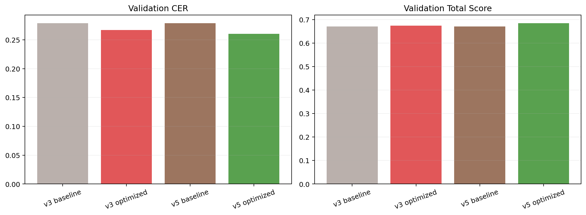
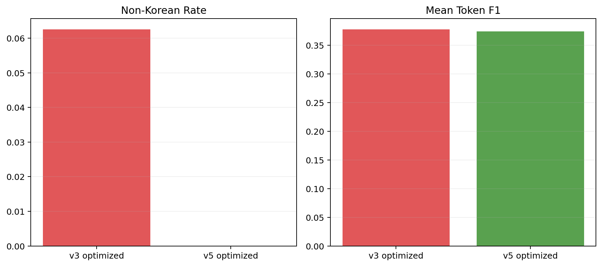

# Non-Korean Suppression Follow-up

작성일: 2026-03-15

## 1. 한눈에 보는 결론

| 질문 | 답 |
|---|---|
| placeholder 금지와 script-substitution 금지가 효과가 있었나? | 예 |
| optimized non-Korean rate | `6.25% -> 0.00%` |
| optimized normalized CER | `0.2668 -> 0.2606` |

이 표의 뜻:
- 이전 v3에서는 optimized prompt가 한자 대체를 일으켜 채택에 실패했다.
- 이번 v5에서는 그 문제가 사라졌고 CER도 더 좋아졌다.

## 2. 비교 차트



이 차트의 뜻:
- v5 optimized는 v3 optimized보다 CER와 total score가 모두 좋아졌다.



이 차트의 뜻:
- 핵심 변화는 non-Korean rate가 0으로 내려간 것이다.
- 즉, 마지막 수정은 실제 문제 원인을 제대로 겨냥했다.

## 3. 최종 optimized prompt

```text
Text Recognition:
Transcribe only the text that is visible, preserving line breaks and order. Output plain text only. Do not translate, correct, normalize, or guess. Do not substitute Korean with other scripts. If a segment is unclear, omit it without adding placeholders. Do not repeat text and keep punctuation as shown.
```

## 4. 해석

이번 후속 실험으로 확인된 것은 두 가지다.

1. `[unclear]` placeholder 금지만으로는 부족했고, `중국어/한자 대체 금지`를 명시해야 했다.
2. 그 규칙을 넣자 stability 문제는 해결됐고, CER도 함께 좋아졌다.

아직 baseline이 채택된 이유는 PRD 규칙이 `CER 개선 + 안정성 지표 개선`을 동시에 요구하는데, baseline도 이미 안정성 지표가 0이라 더 낮출 값이 없기 때문이다.
