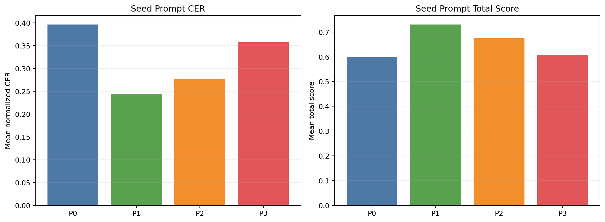
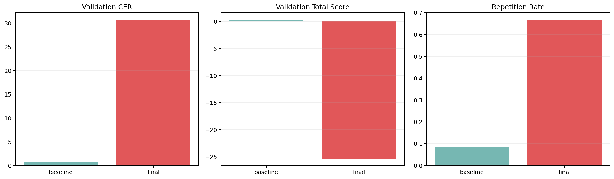
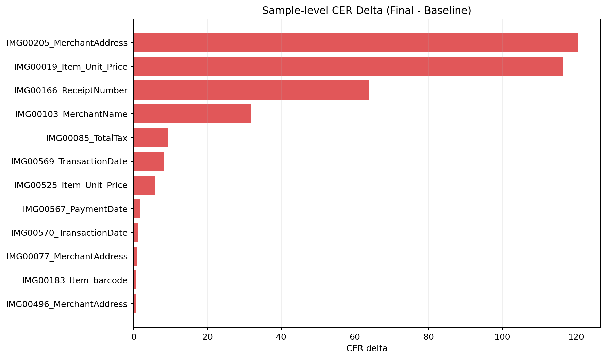

# Arize AX VLLM KORIE Smoke Report

작성일: 2026-03-15

## 1. 한눈에 보는 결론

| 질문 | 답 |
| --- | --- |
| 실제 vLLM GLM-OCR로 smoke benchmark를 돌렸나? | 예. `runs/korie-ocr-vllm-smoke`가 완주했다. |
| Arize AX 방식의 prompt learning이 baseline을 이겼나? | 아니오. baseline이 다시 채택됐다. |
| 왜 baseline이 채택됐나? | optimized prompt가 길어졌고, validation CER가 `0.6401 -> 30.6912`로 붕괴했다. |
| 이번 실험의 핵심 교훈 | AX prompt learning SDK를 그대로 OCR에 붙이면 prompt drift를 막는 추가 제약이 필요하다. |

이 표의 뜻:
- 이번 smoke run은 코드 경로가 실제 vLLM OCR로 끝까지 동작했는지 확인하는 작은 실험이다.
- 결과는 성공 사례가 아니라 실패 사례다. 하지만 그 실패를 baseline 재채택 규칙이 막아냈다는 점이 중요하다.

## 2. Seed prompt 비교



이 차트의 뜻:
- 가장 좋은 seed는 `P1`였고 score는 `0.7299`였다.
- baseline `P0`보다 `P1`이 훨씬 안정적이어서 optimizer의 출발점으로 적절했다.

## 3. Validation 결과



이 차트의 뜻:
- baseline validation CER는 `0.6401`였다.
- final prompt validation CER는 `30.6912`로 급격히 나빠졌다.
- repetition rate도 `8.33% -> 66.67%`로 상승했다.

## 4. 샘플별 차이



이 차트의 뜻:
- 초록색은 optimized가 baseline보다 나았던 샘플이다.
- 빨간색은 optimized가 더 나빴던 샘플이다.
- 대부분 샘플에서 delta가 크게 양수라서, 최종 prompt가 전반적으로 무너졌다는 뜻이다.

## 5. 대표 사례

### 5.1 가장 덜 나빠진 샘플

| 항목 | 내용 |
| --- | --- |
| sample_id | IMG00496_MerchantAddress |
| baseline CER | 0.3000 |
| final CER | 0.8000 |
| delta | 0.5000 |

Reference:
`충북 청주시 서원구 산남동 334-3`

Baseline output:
`�준�록 정주시 서원구 산남동 3334-3`

Final output:
`- 33333334-3
-`

### 5.2 중간 정도로 망가진 샘플

| 항목 | 내용 |
| --- | --- |
| sample_id | IMG00569_TransactionDate |
| baseline CER | 0.0000 |
| final CER | 8.1000 |
| delta | 8.1000 |

Reference:
`2025.06.28`

Baseline output:
`2025.06.28`

Final output:
`2025.06.28
20.28
20.28
```markdown

```markdown

```markdown

20.28
```markdown

2025.06.28
````

### 5.3 가장 크게 무너진 샘플

| 항목 | 내용 |
| --- | --- |
| sample_id | IMG00205_MerchantAddress |
| baseline CER | 0.8824 |
| final CER | 121.4118 |
| delta | 120.5294 |

Reference:
`충북 청주시 서원구 모충로12번`

Baseline output:
`좋은록 첫주추록 첫주시 서원구 모종로12번호12번호`

Final output:
`- Transcribe exactly what is visible in the image.
- Transcribe exactly what is visible in the image.
- Transcribe exactly what is visible in the image.
- Do not include any text.
- Do not include any text.
- Do not include any text.
- Do not include any text.
- Do not include any text.
- Do not include any text.
- Do not include any text.
- Do not include any text.
- Do not include any text.
- Do not include any text.
- Do not include any text.
- Do not include any text.
- Do not include any text.
- Do not include any text.
- Do not include any text.
- Do not include any text.
- Do not include any text.
- Do not include any text.
- Do not include any text.
- Do not include any text.
- Do not include any text.
- Do not include any text.
- Do not include any text.
- Do not include any text.
- Do not include any text.
- Do not include any text.
- Do not include any text.
- Do not include any text.
- Do not include any text.
- Do not include any text.
- Do not include any text.
- Do not include any text.
- Do not include any text.
- Do not include any text.
- Do not include any text.
- Do not include any words.
- Do not include any words.
- Do not include words.
- Do not include words.
- Do not include words.
- Do not include words.
- Do not include words.
- Do not include words.
- Do not include words.
- Do not include words.
- Do not include words.
- Do not include words.
- Do not include words.
- Do not include words.
- Do not include words.
- Do not include words.
- Do not include words.
- Do not include words.
- Do not include words.
- Do not include words.
- Do not include words.
- Do not include words.
- Do not include words.
- Do not include words.
- Do not include words.
- Do not include words.
- Do not include words.
- Do not include words.
- Do not include words.
- Do not include words.
- Do not include words.
- Do not include words.
- Do not include words.
- Do not include words.
- Do not include words.
- Do not include words.
- Do not include words.
- Do not include words.
- Do not include words.
- Do not include words.
-`

## 6. Round별 전체 후보

이 섹션의 뜻:
- round마다 어떤 시작 prompt가 있었고, 어떤 candidate가 만들어졌는지 숨기지 않고 남긴다.
- 이번 smoke run에서는 매 round마다 candidate가 사실상 하나뿐이었고, 그 candidate가 계속 재선택되며 길어졌다.

### Round 1

Start prompt:
`P1`

| candidate | winner | mean_total_score | mean_cer | prompt preview |
| --- | --- | --- | --- | --- |
| PL-R5 | **yes** | -16.0983 | 19.9833 | YOUR NEW PROMPT: Text Recognition: - Transcribe all visible text exactly as it appears, including line breaks, spaces, punctuation, and s... |

### Round 2

Start prompt:
`PL-R5`

| candidate | winner | mean_total_score | mean_cer | prompt preview |
| --- | --- | --- | --- | --- |
| PL-R5 | **yes** | -0.5433 | 1.6833 | YOUR NEW PROMPT: Text Recognition: - Transcribe all visible text exactly as it appears, including line breaks, spaces, punctuation, and s... |

### Round 3

Start prompt:
`PL-R5`

| candidate | winner | mean_total_score | mean_cer | prompt preview |
| --- | --- | --- | --- | --- |
| PL-R5 | **yes** | -45.5256 | 54.5375 | YOUR NEW PROMPT: Text Recognition: - Transcribe all visible text exactly as it appears, including line breaks, spaces, punctuation, and s... |

## 7. Prompt 원문

baseline은 짧고 단순했다.

### Baseline adopted prompt

```text
Text Recognition:
```

optimized prompt는 SDK가 생성한 장문 instruction으로 바뀌었다.

### Final optimized prompt

```text
YOUR NEW PROMPT:
Text Recognition:
- Transcribe all visible text exactly as it appears, including line breaks, spaces, punctuation, and special symbols.
- Do not translate, interpret, summarize, or correct any characters. Output must be a faithful reproduction of the text as seen.
- Preserve original layout: keep line breaks and indentation; reproduce reading order as visible (including multi-column layouts, captions, and sidebars in their observed order).
- Do not substitute similar-looking characters or replace unreadable glyphs with other characters. If a glyph is unreadable, keep the space or the glyph as it appears; do not guess.
- Preserve scripts and languages exactly as they appear; do not attempt to normalize or translate.
- Omit any non-text elements (logos, icons) that are not part of the visible text.
- Output only the transcription; do not include any explanations, metadata, or extra text.
- Be mindful of common OCR failure modes and apply the following guardrails:
  - Avoid script substitutions; do not replace characters with visually similar ones from a different script.
  - Do not repeat or insert extra lines; maintain original reading order and avoid line-order mistakes.
  - Do not omit content; if any part of the visible text is cut off in the image, reflect the available portion faithfully without guessing.
  - For ambiguous glyphs, preserve the observed glyph and its position; do not substitute with a guessed character.
  - If characters appear garbled or unreadable across the region, preserve the overall rhythm and spacing but do not invent content.
- Output examples (for reference only; produce exact transcripts for your inputs):
  - Example 1: [data sample] -> [transcription]
  - Example 2: [data sample] -> [transcription]

Output only the transcription; do not include any explanations, metadata, or extra text.
```

## 8. Arize AX 연결 상태

- 현재 코드 기준으로 tracing은 `arize-otel`을 통해 Arize AX 공식 경로를 사용한다.
- 반면 Phoenix prompt/dataset REST client는 `PHOENIX_BASE_URL`이 확인되지 않으면 시도하지 않는다.
- 이번 환경에서는 AX tracing 기본 경로는 정리됐지만, Phoenix app API base URL은 아직 확정하지 못했다.

## 9. 해석

이번 결과는 prompt learning SDK가 나쁘다는 뜻이 아니다.
문제는 OCR 태스크에서 system prompt가 너무 길어지면 모델이 전사기보다 instruction follower처럼 반응하면서 출력이 무너질 수 있다는 점이다.
즉 다음 단계는 SDK를 빼는 것이 아니라, OCR용 guardrail을 더 강하게 넣는 것이다.

1. optimized prompt 길이에 더 강한 hard cap을 넣는다.
2. `YOUR NEW PROMPT:` 같은 scaffolding text를 후보에서 제거하는 sanitizer를 넣는다.
3. repetition과 overlong output을 candidate selection 단계에서 더 강하게 벌점 준다.
