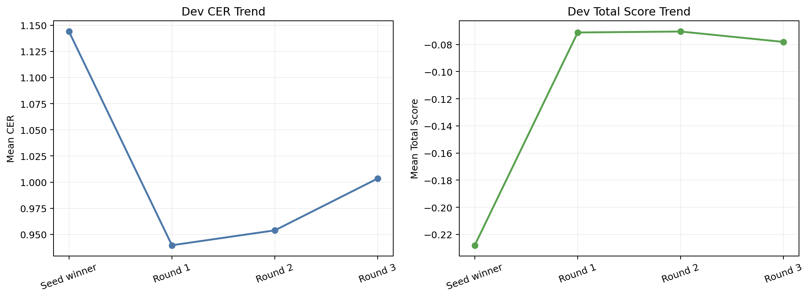
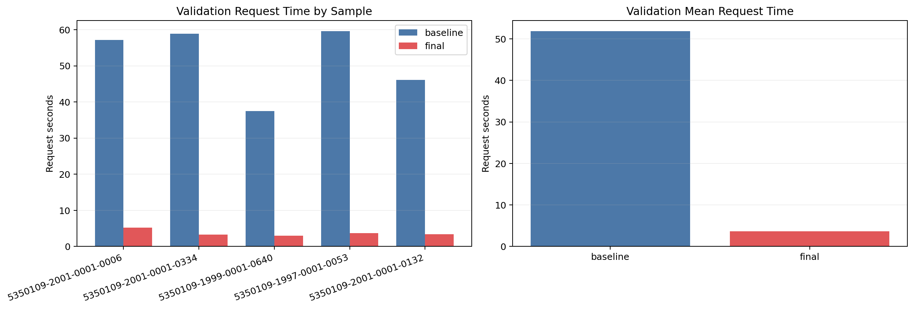
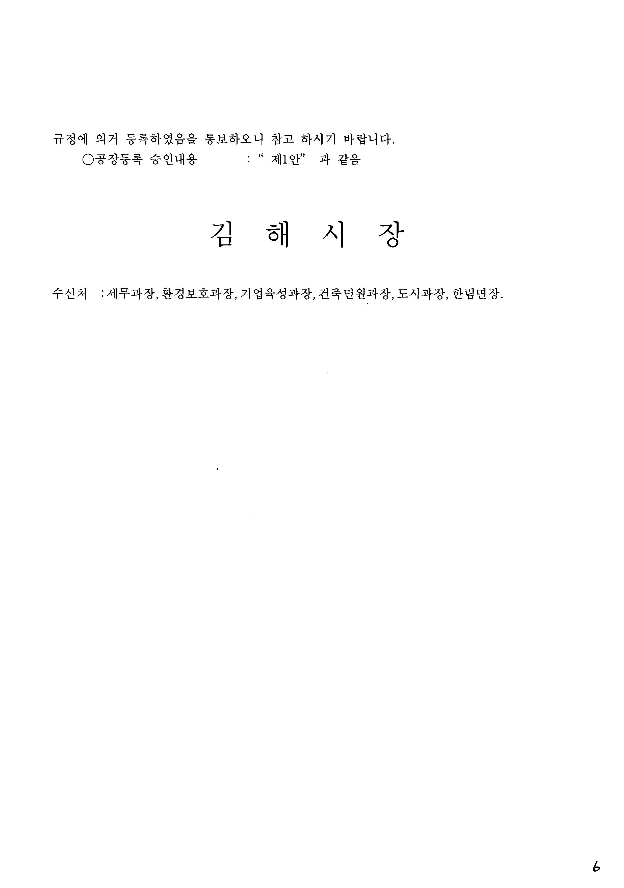
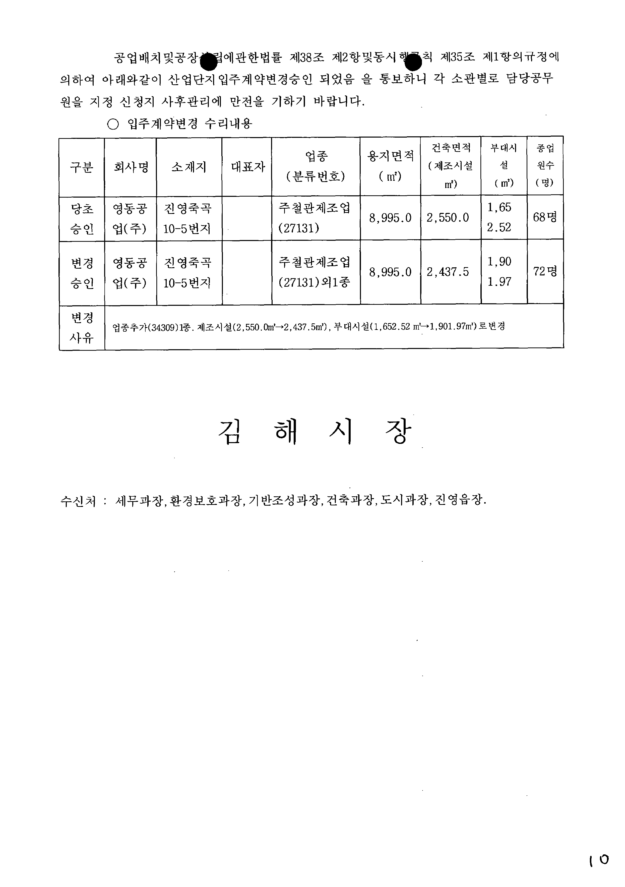

# vLLM Local GLM-OCR Report

작성일: 2026-03-15

## 1. 세 줄 요약

| 질문 | 답 |
| --- | --- |
| 로컬 `vllm` 서빙은 끝까지 안정적으로 돌았나? | 예. `my-vllm-run-8`이 seed, optimize, validation을 모두 완주했다. |
| 최종 프롬프트는 baseline보다 좋아졌나? | 예. validation mean CER가 `1.7005 -> 0.8709`로 개선됐다. |
| 속도 목표도 만족했나? | 아니오. 로컬 GTX 1660 6GB에서는 일부 요청이 여전히 길고, 과거 Ollama 성공 구간 `12~16초/건`을 안정적으로 밑돌았다고 보긴 어렵다. |

이 표의 뜻:
- 이번 작업의 1차 목표였던 `안 죽고 끝까지 서빙하기`는 달성했다.
- 프롬프트 최적화 품질도 baseline보다 좋아졌다.
- 하지만 속도는 아직 넉넉하지 않아서, `빠른 로컬 OCR`로 보기는 어렵다.

## 2. 이번 실험이 무엇을 검증했는가

| 항목 | 내용 |
| --- | --- |
| run | `runs/my-vllm-run-8` |
| 서빙 방식 | 로컬 `vllm` + `zai-org/GLM-OCR` + OpenAI 호환 `/v1/chat/completions` |
| GPU | GTX 1660 SUPER 6GB |
| 입력 전처리 | 가장 긴 변을 `800px`로 제한 |
| 컨텍스트 제한 | `--max-model-len 1024` |
| dev / val | `5 / 5` |

이 표의 뜻:
- 이번 보고서는 모델 자체를 바꾼 것이 아니라, `로컬 vLLM 서빙이 실제로 버티는지`와 `그 상태에서 prompt optimization이 돌아가는지`를 본 것이다.
- 이미지 크기와 컨텍스트 길이는 속도보다 생존성과 완주 가능성을 우선해 보수적으로 잡혔다.

## 3. Seed 프롬프트 비교


| Prompt | Mean CER (낮을수록 좋음) | Mean Total Score (높을수록 좋음) | Repetition Rate (낮을수록 좋음) |
| --- | ---: | ---: | ---: |
| [`P0`](#prompt-p0) | 1.1440 | -0.2280 | 0.80 |
| [`P1`](#prompt-p1) | 1.3350 | -0.3972 | 0.80 |
| [`P2`](#prompt-p2) | 1.2142 | -0.2883 | 0.80 |
| [`P3`](#prompt-p3) | 1.2495 | -0.3237 | 0.80 |

이 차트와 표의 뜻:
- `Mean CER`는 글자를 얼마나 틀렸는지 보여준다. 낮을수록 좋다.
- `Mean Total Score`는 CER와 반복 패널티 등을 합친 종합 점수다. 높을수록 좋다.
- `Repetition Rate`는 같은 내용을 반복 출력한 비율이다. 낮을수록 좋다.
- seed 단계에서는 `P0`가 가장 나은 출발점이었다.
- 이번 dev subset에서는 오히려 가장 짧은 baseline seed `P0`가 출발점으로 가장 강했다.

### Seed 프롬프트 원문

<a id="prompt-p0"></a>
#### Prompt `P0`

```text
Text Recognition:
```

<a id="prompt-p1"></a>
#### Prompt `P1`

```text
Text Recognition:
Transcribe all visible text exactly as it appears.
```

<a id="prompt-p2"></a>
#### Prompt `P2`

```text
Text Recognition:
Transcribe only the visible text.
Output plain text only.
Do not translate, correct, or guess.
Do not substitute Korean text with Chinese characters or other scripts.
```

<a id="prompt-p3"></a>
#### Prompt `P3`

```text
Text Recognition:
Read the image and transcribe only the visible text in plain text.
Preserve the observed reading order and line breaks when clear.
Do not translate, explain, normalize, or guess missing characters.
Do not substitute Korean text with Chinese characters or other scripts.
If part of the text is unclear, keep only the visible portion.
Do not repeat text.
```

## 4. Optimization 라운드 흐름



| Round | Start | Winner | Winner CER (낮을수록 좋음) | Winner Score (높을수록 좋음) |
| --- | --- | --- | ---: | ---: |
| 1 | [`P0`](#prompt-p0) | [`P3`](#prompt-p3) | 0.9396 | -0.0711 |
| 2 | [`P3`](#prompt-p3) | [`P3-Concise-English-4`](#prompt-p3-concise-english-4) | 0.9539 | -0.0704 |
| 3 | [`P3-Concise-English-4`](#prompt-p3-concise-english-4) | [`P3-Concise-English-1`](#prompt-p3-concise-english-1) | 1.0035 | -0.0781 |

이 차트와 표의 뜻:
- 왼쪽 선 그래프의 `CER`는 낮아질수록 좋다.
- 오른쪽 선 그래프의 `Score`는 높아질수록 좋다.
- dev set에서는 1라운드에서 CER가 꽤 개선됐고, 그 다음부터는 비슷한 문장 구조 안에서 미세 조정이 반복됐다.
- 즉, 이번 optimizer는 완전히 새로운 지시문을 찾기보다 `짧은 영어 규칙 프롬프트`를 조금씩 다듬는 방향으로 수렴했다.

### Round 1 전체 후보

| 구분 | Prompt | Mean CER (낮을수록 좋음) | Mean Total Score (높을수록 좋음) | Repetition Rate (낮을수록 좋음) | 비고 |
| --- | --- | ---: | ---: | ---: | --- |
| start | [`P0`](#prompt-p0) | 1.1440 | -0.2280 | - | 기준 프롬프트 |
| candidate | **[`P3`](#prompt-p3)** | 0.9396 | -0.0711 | 0.80 | winner |
| candidate | [`P4`](#prompt-p4) | 0.9649 | -0.0803 | 0.80 |  |
| candidate | [`P2`](#prompt-p2) | 1.1967 | -0.2809 | 0.80 |  |
| candidate | [`ENG-F1`](#prompt-eng-f1) | 1.3208 | -0.3849 | 0.80 |  |
| candidate | [`ENG-F2`](#prompt-eng-f2) | 1.3017 | -0.3689 | 0.80 |  |

이 표의 뜻:
- `start`는 그 라운드에서 후보를 만들 때 기준이 된 프롬프트다.
- 굵게 표시한 행이 실제 winner다.

### Round 2 전체 후보

| 구분 | Prompt | Mean CER (낮을수록 좋음) | Mean Total Score (높을수록 좋음) | Repetition Rate (낮을수록 좋음) | 비고 |
| --- | --- | ---: | ---: | ---: | --- |
| start | [`P3`](#prompt-p3) | 0.9250 | -0.0862 | - | 기준 프롬프트 |
| candidate | **[`P3-Concise-English-4`](#prompt-p3-concise-english-4)** | 0.9539 | -0.0704 | 0.80 | winner |
| candidate | [`P3-Concise-English-5`](#prompt-p3-concise-english-5) | 1.2521 | -0.2936 | 0.60 |  |
| candidate | [`P3-Concise-English-3`](#prompt-p3-concise-english-3) | 1.1720 | -0.2470 | 0.80 |  |
| candidate | [`P3-Concise-English-2`](#prompt-p3-concise-english-2) | 1.2442 | -0.2616 | 0.40 |  |
| candidate | [`P3-Concise-English-1`](#prompt-p3-concise-english-1) | 0.9452 | -0.1099 | 1.00 |  |

이 표의 뜻:
- `start`는 그 라운드에서 후보를 만들 때 기준이 된 프롬프트다.
- 굵게 표시한 행이 실제 winner다.

### Round 3 전체 후보

| 구분 | Prompt | Mean CER (낮을수록 좋음) | Mean Total Score (높을수록 좋음) | Repetition Rate (낮을수록 좋음) | 비고 |
| --- | --- | ---: | ---: | ---: | --- |
| start | [`P3-Concise-English-4`](#prompt-p3-concise-english-4) | 0.9592 | -0.0758 | - | 기준 프롬프트 |
| candidate | [`P3-Concise-English-3`](#prompt-p3-concise-english-3) | 1.2702 | -0.3435 | 0.80 |  |
| candidate | **[`P3-Concise-English-1`](#prompt-p3-concise-english-1)** | 1.0035 | -0.0781 | 0.60 | winner |
| candidate | [`P3-Concise-English-5`](#prompt-p3-concise-english-5) | 1.2313 | -0.3295 | 1.00 |  |
| candidate | [`P3-Concise-English-4`](#prompt-p3-concise-english-4) | 1.2356 | -0.3075 | 0.80 |  |
| candidate | [`P3-Concise-English-2`](#prompt-p3-concise-english-2) | 1.2393 | -0.2803 | 0.60 |  |

이 표의 뜻:
- `start`는 그 라운드에서 후보를 만들 때 기준이 된 프롬프트다.
- 굵게 표시한 행이 실제 winner다.

## 5. Validation 품질 비교


| Prompt | Mean CER (낮을수록 좋음) | Mean Total Score (높을수록 좋음) | Repetition Rate (낮을수록 좋음) |
| --- | ---: | ---: | ---: |
| `baseline` | 1.7005 | -0.6663 | 0.60 |
| `final` | 0.8709 | 0.0806 | 0.40 |

이 차트와 표의 뜻:
- 첫 번째 막대의 `CER`는 낮을수록 좋다.
- 두 번째 막대의 `Total Score`는 높을수록 좋다.
- 세 번째 막대의 `Repetition Rate`는 낮을수록 좋다.
- validation mean CER는 약 `48.8%` 개선됐다.
- repetition rate도 `0.6 -> 0.4`로 줄어서, baseline에서 보이던 반복 출력이 조금 줄었다.
- 다만 absolute CER가 아직 높아서, 품질이 좋아졌다고 해도 실사용 관점에선 여전히 거칠다.

### 최종 프롬프트 비교

<a id="prompt-baseline"></a>
#### Baseline `baseline`

```text
Text Recognition:
```

<a id="prompt-final"></a>
#### Optimized final `final`

```text
Text Recognition: Transcribe only visible text into plain text. Do not translate, correct, or guess. Preserve original reading order and line breaks. Do not convert Korean to other scripts. Do not repeat text. Do not add placeholders for unreadable parts; omit them if unclear.
```

<a id="prompt-adopted"></a>
#### Adopted `adopted`

```text
Text Recognition: Transcribe only visible text into plain text. Do not translate, correct, or guess. Preserve original reading order and line breaks. Do not convert Korean to other scripts. Do not repeat text. Do not add placeholders for unreadable parts; omit them if unclear.
```

## 6. Validation 속도 비교



| Prompt | Mean request seconds (낮을수록 좋음) | 비고 |
| --- | ---: | --- |
| `baseline` | 51.84 | 긴 응답을 자주 생성하며 매우 느렸다 |
| `final` | 3.69 | 평균은 크게 줄었지만 여전히 빠르다고 보긴 어렵다 |

이 차트와 표의 뜻:
- 이 섹션의 `request seconds`는 낮을수록 좋다.
- 왼쪽 그래프는 샘플별 요청 시간이고, 오른쪽 그래프는 평균 요청 시간이다.
- 이번 validation에서는 optimized prompt가 baseline보다 훨씬 짧고 안정적으로 끝났다.
- 하지만 이 결과를 `로컬 vLLM이 충분히 빠르다`로 해석하면 안 된다.
- 과거 Ollama 성공 로그 기준 `12~16초/건`과 비교하면, 이번 run은 일부 요청이 여전히 그 구간을 넘었다.

## 7. 샘플별 영향


| Sample | Baseline CER (낮을수록 좋음) | Final CER (낮을수록 좋음) | Delta (음수면 개선) |
| --- | ---: | ---: | ---: |
| [`5350109-2001-0001-0334`](../data/manifests/aihub-public-admin-ocr/../../external/aihub/public-admin-ocr/원천데이터/인.허가/5350109/2001/5350109-2001-0001-0334.jpg) | 2.5281 | 0.7640 | -1.7640 |
| [`5350109-1999-0001-0640`](../data/manifests/aihub-public-admin-ocr/../../external/aihub/public-admin-ocr/원천데이터/인.허가/5350109/1999/5350109-1999-0001-0640.jpg) | 2.0750 | 0.8500 | -1.2250 |
| [`5350109-2001-0001-0006`](../data/manifests/aihub-public-admin-ocr/../../external/aihub/public-admin-ocr/원천데이터/인.허가/5350109/2001/5350109-2001-0001-0006.jpg) | 1.8595 | 0.8378 | -1.0216 |
| [`5350109-1997-0001-0053`](../data/manifests/aihub-public-admin-ocr/../../external/aihub/public-admin-ocr/원천데이터/인.허가/5350109/1997/5350109-1997-0001-0053.jpg) | 1.0703 | 0.9588 | -0.1115 |
| [`5350109-2001-0001-0132`](../data/manifests/aihub-public-admin-ocr/../../external/aihub/public-admin-ocr/원천데이터/인.허가/5350109/2001/5350109-2001-0001-0132.jpg) | 0.9694 | 0.9439 | -0.0255 |

이 차트의 뜻:
- 여기서 `Delta`는 `final - baseline`이다.
- 그래서 막대가 왼쪽, 즉 음수일수록 final prompt가 더 좋아진 것이다.
- 5개 validation 샘플 모두에서 final prompt가 baseline보다 같거나 더 좋았다.
- 다만 개선폭이 큰 샘플도 여전히 CER가 높아서, 문서 OCR 자체가 이 환경에선 어려운 편이다.

## 8. 대표 비교 사례

### 더 나은 사례: `5350109-2001-0001-0334`



원본 이미지: [dataset image](../data/manifests/aihub-public-admin-ocr/../../external/aihub/public-admin-ocr/원천데이터/인.허가/5350109/2001/5350109-2001-0001-0334.jpg)

**Reference**

```text
규정에의거등록하였음을통보하오니참고하시기바랍니다.
○공장등록승인내용 : " 제1안" 과같음
김해 시 장
수신처 :세무과장,환경보호과장,기업육성과장,건축민원과장,도시과장,한림면장.
6
```

**Baseline OCR**

```text
귀경에 의거 동특하였어서기 바랍하오니다.

○공장동특별특별료속속속속속속속속속속속속속속속속속속속속속속속속속속속속속속속속속속속속속속속속속속속속속속속속속속속속속속속속속속속속속속속속속속속속속속속속속속속속속속속속속속속속속속속속속속속속속속속속속속속속속속속속속속속속속속속속속속속속속속속속속속속속속속속속속속속속속속속속속속속속속속속속속속속속속속속속속속속속속속속속속속속속속속속속속속속속속속속속속속속속속속속속속속속속속속속속속속속속속
```

**Final OCR**

```text
귀경에 의거 동뜻하였을 통해오니다.

○공장동록특별료를 손인바라는

김해서

김해서 입니다.

김해서 입니다.

6
```

이 사례의 뜻: CER 변화는 `-1.7640`다.

### 여전히 어려운 사례: `5350109-2001-0001-0132`



원본 이미지: [dataset image](../data/manifests/aihub-public-admin-ocr/../../external/aihub/public-admin-ocr/원천데이터/인.허가/5350109/2001/5350109-2001-0001-0132.jpg)

**Reference**

```text
공업배치및공장 제38조제2항및동시 제35조제1항의규정에
의하여아래와같이산업단지입주계약변경승인되었음을통보하니각소관별로담당공무
원을지정신청지사후관리에만전을기하기바랍니다.
○입주계약변경수리내용
업종 용지면적 건축면적 부대시 종업
구분 회사명 소재지 대표자 (제조시설 설 원수
(분류번호) (㎡) ㎡) (㎡) ( 명)
당초 영동공 진영죽곡 주철관제조업 8,995.0 2,550.0 1,65 68명
승인 업(주) 10-5번지 (27131) 2.52
변경 영동공 진영죽곡 주철관제조업 8,995.0 2,437.5 1,90 72명
승인 업(주) 10-5번지 (27131)외1종 1.97
변경
업종추가(34309)1종.제조시설(2,550.0㎡→2,437.5㎡),부대시설(1,652.52㎡→1,901.97㎡)로변경
사유
김해 시장
수신처 : 세무과장,환경보호과장,기반조성과장,건축과장,도시과장,진영읍장.
10
```

**Baseline OCR**

```text
공업업반반대로 단말라이하여야 한다.
```

**Final OCR**

```text
공업업반대로 단체로 단체체체체체체체체체체체체체체체체체체체체체체체체체체체체체제로서는 입력을 반대로만을 반대에 있을 포함수입니다.
```

이 사례의 뜻: improvement가 가장 작은 샘플도 여전히 CER는 `0.9439`로 높다.

## 9. 해석

이번 실험에서 확정적으로 말할 수 있는 것은 세 가지다.

1. `vllm` 로컬 서빙은 이 환경에서 `ollama`보다 적어도 더 안정적으로 끝까지 돈다.
2. prompt optimization은 baseline보다 더 나은 지시문을 실제로 찾았다.
3. 하지만 GTX 1660 SUPER 6GB에서는 속도 여유가 작아서, 로컬 운영 환경으로는 아직 타이트하다.

## 10. 다음 단계

| 제안 | 이유 |
| --- | --- |
| 현재 `800px / max-model-len 1024`를 운영 기본값으로 고정 | 이번 조합이 처음으로 완주 가능한 조합이었다 |
| 속도 비교 실험은 prompt 변화보다 입력 크기와 문서 유형별로 따로 수행 | 지금 병목은 프롬프트보다 추론 자원 한계에 더 가깝다 |
| 보고서 후속판에서는 더 큰 GPU나 외부 API와의 비교 추가 | 이번 보고서는 로컬 vLLM 단일 환경 기록에 가깝다 |

## 부록 A. Round별 전체 프롬프트 원문

이 부록의 뜻:
- winner만이 아니라 탈락한 후보까지 문서 안에서 바로 추적할 수 있다.
- 다음 실험에서 어떤 문구가 이미 시도됐는지 다시 확인하기 쉽다.

### Round 1 프롬프트 원문

#### Start `P0`

```text
Text Recognition:
```

#### `P3` (winner)

```text
Text Recognition: Transcribe only visible text in plain text. Do not translate, correct, normalize, or guess. Preserve reading order and line breaks when visually clear. Do not substitute Korean text with other scripts. Do not repeat content. Do not include placeholders for unreadable parts. If any segment is unclear, omit that segment entirely. Output nothing else beyond the transcription.
```

<a id="prompt-p4"></a>
#### `P4`

```text
Text Recognition: Transcribe only the visible text. Output plain text only. Do not translate, correct, normalize, or guess. Preserve reading order and line breaks. Do not substitute Korean text with Chinese or other scripts. Do not repeat text. Do not insert placeholders for unreadable sections. If a portion is unreadable, omit it. Do not add any commentary or formatting beyond the transcription.
```

#### `P2`

```text
Text Recognition: Transcribe only the text that is visibly present. Output plain text only. Do not translate, correct, normalize, or guess. Keep the original reading order and line breaks as they appear. Do not substitute Korean with Chinese or other scripts. Do not repeat text. Do not insert brackets or markers for unreadable sections. If a part is unclear, omit it entirely and continue with the rest. Do not exceed the length of the original text and avoid extraneous commentary.
```

<a id="prompt-eng-f1"></a>
#### `ENG-F1`

```text
Text Recognition:
Transcribe all visible text exactly as it appears.
Output plain text only.
Do not translate, correct, or guess.
```

<a id="prompt-eng-f2"></a>
#### `ENG-F2`

```text
Text Recognition:
Read the image and transcribe only the visible text.
Preserve the observed reading order and line breaks when clear.
Do not translate, explain, normalize, or infer missing text.
```

### Round 2 프롬프트 원문

#### Start `P3`

```text
Text Recognition: Transcribe only visible text in plain text. Do not translate, correct, normalize, or guess. Preserve reading order and line breaks when visually clear. Do not substitute Korean text with other scripts. Do not repeat content. Do not include placeholders for unreadable parts. If any segment is unclear, omit that segment entirely. Output nothing else beyond the transcription.
```

<a id="prompt-p3-concise-english-4"></a>
#### `P3-Concise-English-4` (winner)

```text
Text Recognition: Transcribe only visible text into plain text. Do not translate, correct, or guess. Keep original reading order and line breaks. Do not convert Korean to other scripts. No repeated text. Do not add placeholders for unreadable parts; omit them if unclear.
```

<a id="prompt-p3-concise-english-5"></a>
#### `P3-Concise-English-5`

```text
Text Recognition: Transcribe only the visible text in plain text. Do not translate, modify, or guess. Preserve the original reading order and line breaks. Do not substitute Korean text with any other script. Do not repeat text or use placeholders for unreadable areas; omit unclear segments.
```

<a id="prompt-p3-concise-english-3"></a>
#### `P3-Concise-English-3`

```text
Text Recognition: Transcribe only the text you can see. Output exactly plain text. Do not translate, correct, normalize, or guess. Preserve line breaks and reading order. Do not substitute Korean with other scripts. Do not repeat content. Do not insert placeholders for unreadable segments; omit them when unclear.
```

<a id="prompt-p3-concise-english-2"></a>
#### `P3-Concise-English-2`

```text
Text Recognition: Transcribe only the text that is visibly present in the image. Output plain text only. Do not translate, fix, normalize, or guess. Maintain reading order and line breaks as shown. Do not replace Korean with other scripts. Do not repeat text. Do not use placeholders for unreadable portions. If any part is unclear, omit that part entirely.
```

<a id="prompt-p3-concise-english-1"></a>
#### `P3-Concise-English-1`

```text
Text Recognition: Transcribe only visible text in plain text. Do not translate, correct, normalize, or guess. Preserve reading order and line breaks when visually clear. Do not substitute Korean text with other scripts. Do not repeat content. Do not include placeholders for unreadable parts. If a segment is unreadable, omit it. Output nothing beyond the transcription.
```

### Round 3 프롬프트 원문

#### Start `P3-Concise-English-4`

```text
Text Recognition: Transcribe only visible text into plain text. Do not translate, correct, or guess. Keep original reading order and line breaks. Do not convert Korean to other scripts. No repeated text. Do not add placeholders for unreadable parts; omit them if unclear.
```

#### `P3-Concise-English-3`

```text
Text Recognition: Transcribe only visible text into plain text. Do not translate, fix, or guess. Maintain original line breaks and reading order. Do not convert Korean to other scripts. Do not repeat content. If a section is unreadable, omit it without placeholders.
```

#### `P3-Concise-English-1` (winner)

```text
Text Recognition: Transcribe only visible text into plain text. Do not translate, correct, or guess. Preserve original reading order and line breaks. Do not convert Korean to other scripts. Do not repeat text. Do not add placeholders for unreadable parts; omit them if unclear.
```

#### `P3-Concise-English-5`

```text
Text Recognition: Transcribe only visible text into plain text. Do not translate, correct, guess, or normalize. Preserve original reading order and line breaks. Do not substitute Korean with other scripts. Do not repeat text. If any part is unreadable, omit it; do not insert placeholders.
```

#### `P3-Concise-English-4`

```text
Text Recognition: Transcribe only the visible text. Output plain text only. Preserve reading order and line breaks. Do not translate, correct, normalize, or guess. Do not substitute Korean text with other scripts. Do not repeat text. Omit unreadable portions if unclear; do not use markers.
```

#### `P3-Concise-English-2`

```text
Text Recognition: Transcribe only the text that is visibly legible. Output plain text only. Keep exact reading order and line breaks. Do not translate, correct, normalize, or guess. Do not substitute Korean with other scripts. Do not repeat text; omit unreadable portions without placeholders.
```
