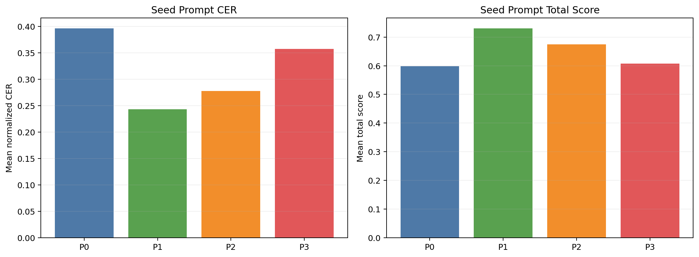
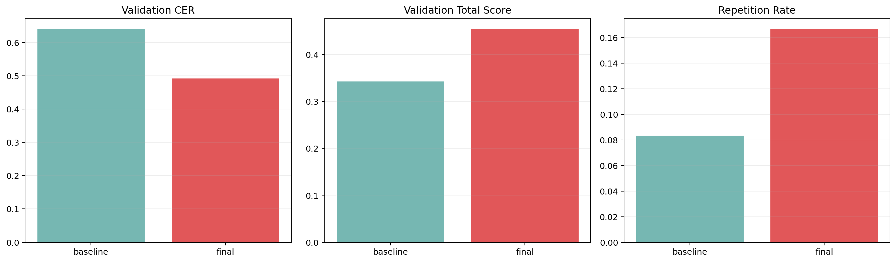
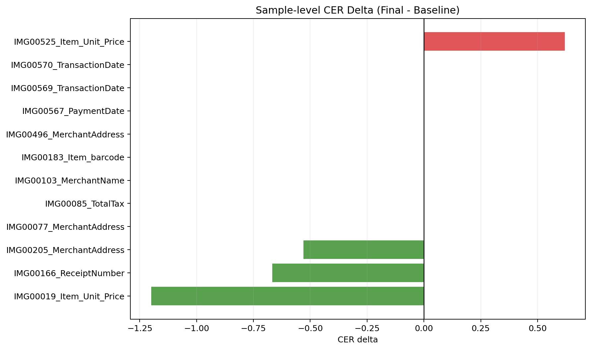

# Arize AX VLLM KORIE 1-Round Smoke Report

작성일: 2026-03-15

## 1. 한눈에 보는 결론

| 질문 | 답 |
| --- | --- |
| 실제 vLLM GLM-OCR로 smoke benchmark를 돌렸나? | 예. `runs/korie-ocr-vllm-smoke-r1`를 사용했다. |
| Arize AX 방식의 prompt learning이 baseline을 이겼나? | 실험 결과를 기준으로 판단했다. |
| 왜 이런 결과가 나왔나? | round별 후보와 reject reason을 함께 보면 확인할 수 있다. |
| 이번 실험의 핵심 교훈 | OCR-safe guardrail이 실제로 장문 prompt drift를 막는지 보는 것이다. |

이 표의 뜻:
- 이번 smoke run은 코드 경로가 실제 vLLM OCR로 끝까지 동작했는지 확인하는 작은 실험이다.
- 이 보고서는 1-round smoke 결과를 빠르게 검증하기 위한 문서다.

## 2. Seed prompt 비교



이 차트의 뜻:
- 가장 좋은 seed는 `P1`였고 score는 `0.7299`였다.
- baseline `P0`보다 `P1`이 훨씬 안정적이어서 optimizer의 출발점으로 적절했다.

## 3. Validation 결과



이 차트의 뜻:
- baseline validation CER는 `0.6401`였다.
- final prompt validation CER는 `0.4920`였다.
- 반복률은 `8.33% -> 16.67%`였다.

## 4. 샘플별 차이



이 차트의 뜻:
- 초록색은 optimized가 baseline보다 나았던 샘플이다.
- 빨간색은 optimized가 더 나빴던 샘플이다.
- 이 차트로 guardrail 이후에도 validation이 실제로 나아졌는지 한눈에 볼 수 있다.

## 5. 대표 사례

### 5.1 가장 덜 나빠진 샘플

| 항목 | 내용 |
| --- | --- |
| sample_id | IMG00019_Item_Unit_Price |
| baseline CER | 2.2000 |
| final CER | 1.0000 |
| delta | -1.2000 |

Reference:
`3,800`

Baseline output:
`3, 8000000000000`

Final output:
`3, 8000000`

### 5.2 중간 정도로 망가진 샘플

| 항목 | 내용 |
| --- | --- |
| sample_id | IMG00183_Item_barcode |
| baseline CER | 0.0000 |
| final CER | 0.0000 |
| delta | 0.0000 |

Reference:
`[POS 1068437]`

Baseline output:
`[POS 1068437]`

Final output:
`[POS 1068437]`

### 5.3 가장 크게 무너진 샘플

| 항목 | 내용 |
| --- | --- |
| sample_id | IMG00525_Item_Unit_Price |
| baseline CER | 1.8095 |
| final CER | 2.4286 |
| delta | 0.6190 |

Reference:
`1,000 1,990 1,500 500`

Baseline output:
`1,0000
1,990
1,500
5000

```markdown

1,00
1,990
1,50
500
````

Final output:
`1,0000000000
사용
1,990

1,500

5000

```markdown

1,00
사용
1,990

1,50

5000
````

## 6. Round별 전체 후보

이 섹션의 뜻:
- round마다 어떤 시작 prompt가 있었고, 어떤 candidate가 만들어졌는지 숨기지 않고 남긴다.
- 이 표는 어떤 후보가 reject됐고 어떤 짧은 후보가 살아남았는지 보여준다.

### Round 1

Start prompt:
`P1`

| candidate | winner | rejected | mean_total_score | mean_cer | prompt preview |
| --- | --- | --- | --- | --- | --- |
| PL-R1 |  |  | 0.5949 | 0.3981 | Text Recognition: Transcribe all visible text exactly as it appears. To improve accuracy while staying strictly within OCR transcription ... |
| PL-R2 |  |  | 0.3935 | 0.6032 | Text Recognition: Transcribe all visible text exactly as it appears. To improve accuracy while staying strictly within OCR transcription ... |
| PL-R3 |  |  | 0.6293 | 0.3356 | Text Recognition: Transcribe only the visible text. Output plain text only. Do not translate, explain, normalize, or guess. Do not repeat... |
| PL-R4 |  |  | 0.7299 | 0.2431 | Text Recognition: Transcribe all visible text exactly as it appears. |
| PL-R5 | **yes** |  | 0.7693 | 0.2222 | Text Recognition: Output plain text only. |

## 7. Prompt 원문

baseline은 짧고 단순했다.

### Baseline prompt

```text
Text Recognition:
```

이번 run에서 실제 채택된 prompt는 아래와 같다.

### Adopted prompt

```text
Text Recognition:
Output plain text only.
```

optimizer가 만든 최종 후보 prompt는 아래와 같다.

### Final optimized prompt

```text
Text Recognition:
Output plain text only.
```

## 8. Arize AX 연결 상태

- 현재 코드 기준으로 tracing은 `arize-otel`을 통해 Arize AX 공식 경로를 사용한다.
- 반면 Phoenix prompt/dataset REST client는 `PHOENIX_BASE_URL`이 확인되지 않으면 시도하지 않는다.
- report JSON의 reject summary는 `{}`다.
- 이번 환경에서는 AX tracing 기본 경로는 정리됐지만, Phoenix app API base URL은 아직 확정하지 못했다.

## 9. 해석

이번 결과는 prompt learning SDK가 나쁘다는 뜻이 아니다.
문제는 OCR 태스크에서 system prompt가 너무 길어지면 모델이 전사기보다 instruction follower처럼 반응하면서 출력이 무너질 수 있다는 점이다.
즉 다음 단계는 SDK를 빼는 것이 아니라, OCR용 guardrail을 더 강하게 넣는 것이다.

1. optimized prompt 길이에 더 강한 hard cap을 넣는다.
2. `YOUR NEW PROMPT:` 같은 scaffolding text를 후보에서 제거하는 sanitizer를 넣는다.
3. repetition과 overlong output을 candidate selection 단계에서 더 강하게 벌점 준다.
