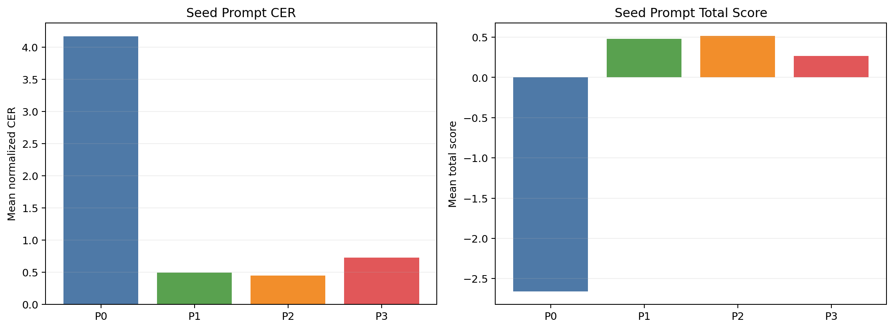
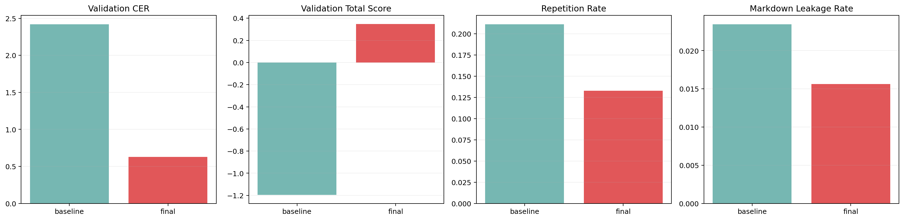
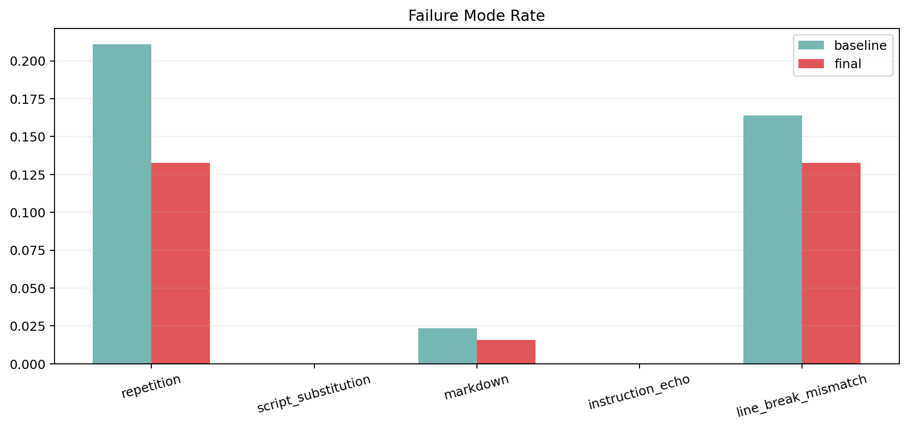
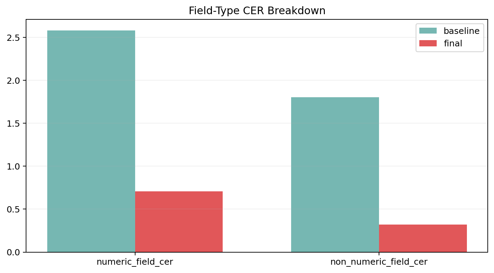
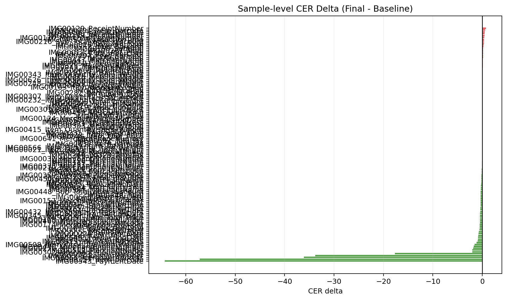

# Arize AX VLLM KORIE OCR Rules Benchmark Report

작성일: 2026-03-15

## 1. 한눈에 보는 결론

| 질문 | 답 |
| --- | --- |
| 실제 vLLM GLM-OCR로 smoke benchmark를 돌렸나? | 예. `runs/korie-ocr-vllm-benchmark-ocr-rules`를 사용했다. |
| Arize AX 방식의 prompt learning이 baseline을 이겼나? | 실험 결과를 기준으로 판단했다. |
| 왜 이런 결과가 나왔나? | round별 후보와 reject reason을 함께 보면 확인할 수 있다. |
| 이번 실험의 핵심 교훈 | OCR-safe guardrail이 실제로 장문 prompt drift를 막는지 보는 것이다. |

이 표의 뜻:
- 이번 smoke run은 코드 경로가 실제 vLLM OCR로 끝까지 동작했는지 확인하는 작은 실험이다.
- 이 보고서는 1-round smoke 결과를 빠르게 검증하기 위한 문서다.

## 2. Seed prompt 비교



이 차트의 뜻:
- 가장 좋은 seed는 `P2`였고 score는 `0.5159`였다.
- baseline `P0`보다 `P1`이 훨씬 안정적이어서 optimizer의 출발점으로 적절했다.

## 3. Validation 결과



이 차트의 뜻:
- baseline validation CER는 `2.4185`였다.
- final prompt validation CER는 `0.6271`였다.
- 반복률은 `21.09% -> 13.28%`였다.
- markdown leakage는 `2.34% -> 1.56%`였다.

## 4. 실패 모드 비교



이 차트의 뜻:
- baseline과 final이 반복, 스크립트 치환, markdown leakage, instruction echo, 줄바꿈 붕괴에서 얼마나 달라졌는지 보여준다.
- prompt optimization이 실제로 어떤 실패 모드를 줄였는지 확인하는 핵심 차트다.

## 5. 필드 타입별 차이



이 차트의 뜻:
- 숫자 위주 필드와 일반 텍스트 필드를 분리해 CER를 비교한다.
- 숫자 필드가 무너지면 평균 CER가 좋아 보여도 채택하기 어렵다.

## 6. 샘플별 차이



이 차트의 뜻:
- 초록색은 optimized가 baseline보다 나았던 샘플이다.
- 빨간색은 optimized가 더 나빴던 샘플이다.
- 이 차트로 guardrail 이후에도 validation이 실제로 나아졌는지 한눈에 볼 수 있다.

## 7. 대표 사례

### 5.1 가장 덜 나빠진 샘플

| 항목 | 내용 |
| --- | --- |
| sample_id | IMG00543_PaymentDate |
| baseline CER | 65.2000 |
| final CER | 0.9333 |
| delta | -64.2667 |

Reference:
`24-06-04 21:01,`

Baseline output:
`211:06 : 06 : 0000000000000000000000000000000000000000000000000000000000000000000000000000000000000000000000000000000000000000000000000000000000000000000000000000000000000000000000000000000000000000000000000000000000000000000000000000000000000000000000000000000000000000000000000000000000000000000000000000000000000000000000000000000000000000000000000000000000000000000000000000000000000000000000000000000000000000000000000000000000000000000000000000000000000000000000000000000000000000000000000000000000000000000000000000000000000000000000000000000000000000000000000000000000000000000000000000000000000000000000000000000000000000000000000000000000000000000000000000000000000000000000000000000000000000000000000000000000000000000000000000000000000000000000000000000000000000000000000000000000000000000000000000000000000000000000000000000000000000000000000000000000000000000000000000000000000000000000000000000000000000000000000000000000000000000000000000000000000000000000000000000000`

Final output:
`21:06 : 06 : 06 : 00`

### 5.2 중간 정도로 망가진 샘플

| 항목 | 내용 |
| --- | --- |
| sample_id | IMG00437_Item_barcode |
| baseline CER | 0.1111 |
| final CER | 0.1111 |
| delta | 0.0000 |

Reference:
`[1030477]`

Baseline output:
`[10304777]`

Final output:
`[103047]`

### 5.3 가장 크게 무너진 샘플

| 항목 | 내용 |
| --- | --- |
| sample_id | IMG00129_ReceiptNumber |
| baseline CER | 1.2500 |
| final CER | 2.0000 |
| delta | 0.7500 |

Reference:
`0003`

Baseline output:
`000000003`

Final output:
`000000000003`

## 8. Round별 전체 후보

이 섹션의 뜻:
- round마다 어떤 시작 prompt가 있었고, 어떤 candidate가 만들어졌는지 숨기지 않고 남긴다.
- 이 표는 어떤 후보가 reject됐고 어떤 짧은 후보가 살아남았는지 보여준다.

### Round 1

Start prompt:
`P2`

| candidate | winner | rejected | mean_total_score | mean_cer | prompt preview |
| --- | --- | --- | --- | --- | --- |
| PL-R1 | **yes** |  | 0.5017 | 0.4620 | Text Recognition: Transcribe only the visible text exactly as it appears. Output plain text only. |
| PL-R2 |  |  | 0.3987 | 0.5769 | Text Recognition: Transcribe only the visible text exactly as it appears. Output plain text only. Do not repeat text. Do not include mark... |
| PL-R3 |  |  | 0.5031 | 0.4588 | Text Recognition: Transcribe only the visible text exactly as it appears. Output plain text only. Do not translate, normalize, or correct... |
| PL-R4 |  | mean_cer_too_high, numeric_field_cer_too_high, negative_total_score | -2.4523 | 3.9300 | Text Recognition: Transcribe only the visible text exactly as it appears. Output plain text only. Preserve reading order and line breaks ... |
| PL-R5 |  |  | 0.2520 | 0.7468 | Text Recognition: Transcribe only the visible text exactly as it appears. Output plain text only. For prices, quantities, dates, and code... |
| PL-R6 |  | mean_cer_too_high, numeric_field_cer_too_high, negative_total_score | -4.8160 | 6.6934 | Text Recognition: Transcribe only the visible text exactly as it appears. Output plain text only. Do not translate, normalize, or correct... |

### Round 2

Start prompt:
`PL-R1`

| candidate | winner | rejected | mean_total_score | mean_cer | prompt preview |
| --- | --- | --- | --- | --- | --- |
| PL-R1 | **yes** |  | 0.5027 | 0.4609 | Text Recognition: Transcribe only the visible text exactly as it appears. Output plain text only. |
| PL-R2 |  |  | 0.3977 | 0.5781 | Text Recognition: Transcribe only the visible text exactly as it appears. Output plain text only. Do not repeat text. Do not include mark... |
| PL-R3 |  |  | 0.4965 | 0.4631 | Text Recognition: Transcribe only the visible text exactly as it appears. Output plain text only. Do not translate, normalize, or correct... |
| PL-R4 |  | mean_cer_too_high, numeric_field_cer_too_high, negative_total_score | -2.4523 | 3.9300 | Text Recognition: Transcribe only the visible text exactly as it appears. Output plain text only. Preserve reading order and line breaks ... |
| PL-R5 |  |  | 0.2492 | 0.7500 | Text Recognition: Transcribe only the visible text exactly as it appears. Output plain text only. For prices, quantities, dates, and code... |
| PL-R6 |  | mean_cer_too_high, negative_total_score | -0.2313 | 1.2912 | Text Recognition: Transcribe only the visible text exactly as it appears. Output plain text only. Do not repeat text. Preserve reading or... |

### Round 3

Start prompt:
`PL-R1`

| candidate | winner | rejected | mean_total_score | mean_cer | prompt preview |
| --- | --- | --- | --- | --- | --- |
| PL-R1 | **yes** |  | 0.5027 | 0.4609 | Text Recognition: Transcribe only the visible text exactly as it appears. Output plain text only. |
| PL-R2 |  |  | 0.3977 | 0.5781 | Text Recognition: Transcribe only the visible text exactly as it appears. Output plain text only. Do not repeat text. Do not include mark... |
| PL-R3 |  |  | 0.4965 | 0.4631 | Text Recognition: Transcribe only the visible text exactly as it appears. Output plain text only. Do not translate, normalize, or correct... |
| PL-R4 |  | mean_cer_too_high, numeric_field_cer_too_high, negative_total_score | -2.4523 | 3.9300 | Text Recognition: Transcribe only the visible text exactly as it appears. Output plain text only. Preserve reading order and line breaks ... |
| PL-R5 |  |  | 0.2492 | 0.7500 | Text Recognition: Transcribe only the visible text exactly as it appears. Output plain text only. For prices, quantities, dates, and code... |
| PL-R6 |  | mean_cer_too_high, negative_total_score | -0.2335 | 1.2939 | Text Recognition: Transcribe only the visible text exactly as it appears. Output plain text only. Do not repeat text. Preserve reading or... |

## 9. Prompt 원문

baseline은 짧고 단순했다.

### Baseline prompt

```text
Text Recognition:
```

이번 run에서 실제 채택된 prompt는 아래와 같다.

### Adopted prompt

```text
Text Recognition:
Transcribe only the visible text exactly as it appears.
Output plain text only.
```

optimizer가 만든 최종 후보 prompt는 아래와 같다.

### Final optimized prompt

```text
Text Recognition:
Transcribe only the visible text exactly as it appears.
Output plain text only.
```

## 10. Arize AX 연결 상태

- 현재 코드 기준으로 tracing은 `arize-otel`을 통해 Arize AX 공식 경로를 사용한다.
- 반면 Phoenix prompt/dataset REST client는 `PHOENIX_BASE_URL`이 확인되지 않으면 시도하지 않는다.
- report JSON의 reject summary는 `{'mean_cer_too_high': 6, 'numeric_field_cer_too_high': 4, 'negative_total_score': 6}`다.
- 이번 환경에서는 AX tracing 기본 경로는 정리됐지만, Phoenix app API base URL은 아직 확정하지 못했다.

## 11. 해석

이번 결과는 prompt learning SDK가 나쁘다는 뜻이 아니다.
문제는 OCR 태스크에서 system prompt가 너무 길어지면 모델이 전사기보다 instruction follower처럼 반응하면서 출력이 무너질 수 있다는 점이다.
즉 다음 단계는 SDK를 빼는 것이 아니라, OCR용 guardrail을 더 강하게 넣는 것이다.

1. optimized prompt 길이에 더 강한 hard cap을 넣는다.
2. `YOUR NEW PROMPT:` 같은 scaffolding text를 후보에서 제거하는 sanitizer를 넣는다.
3. repetition과 overlong output을 candidate selection 단계에서 더 강하게 벌점 준다.
